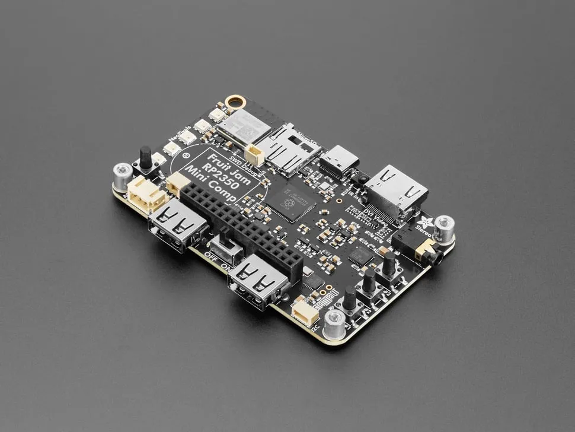

# 迷你 RP2350 电脑
一台“信用卡尺寸”的计算机——尺寸为 3.375 英寸 x 2.125 英寸（8.57cm x 5.4cm）， 大小大约和一张名片差不多，而且甚至有一个标准专门命名：[ISO/IEC 7810 ID-1](https://www.iso.org/standard/70483.html)。

## 规格
- RP2350B dual 150MHz Cortex M33 microcontroller
- PicoProbe debug port
- 16 MB Flash + 8 MB PSRAM - the PSRAM will help when we want do do things like run emulations that we need to store in fast RAM access, and also let us use the main SRAM as the DVI video buffer.
- USB type C for bootloading/USB client
- Micro SD card with SPI or SDIO
- DVI output on the HSTX port
- I2S stereo headphone + mono speaker via the [TLV320DAC3100](https://www.digikey.com/en/products/detail/texas-instruments/tlv320dac3100irhbt/2353656)
- 2-port USB type A hub for both keyboard and mouse or game controllers
- ESP32-C6 for WiFi / Internet connectivity
- Chunky on-off switch
- Stemma QT I2C
- Stemma classic JST 3-pin
- 5x NeoPixels
- 3x tactile switches
- 16-pin socket header with 10 A/D GPIO + 5V/3V/GND power pins.

## 相关链接

- [产品网站](https://www.adafruit.com/product/6200)
- [github仓库](https://github.com/fhoedemakers/retroJam)

