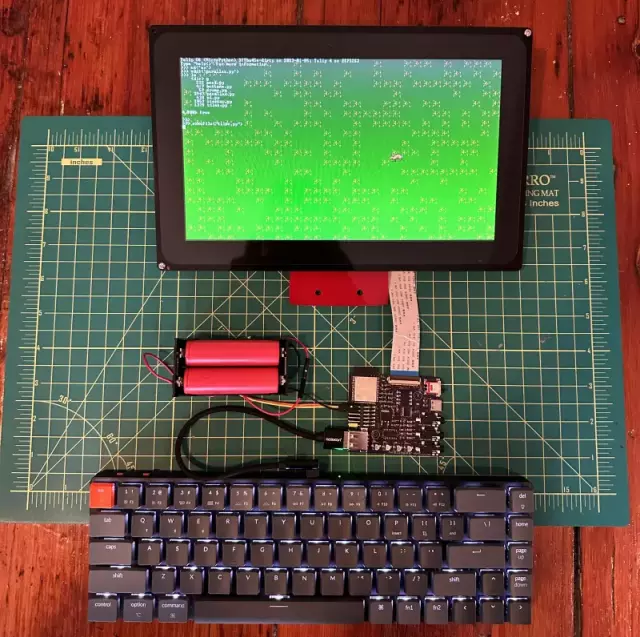

# 郁金香创意计算机

一款便携式可编程音乐、图形、代码和写作设备。

郁金香（Tulip）是一款低功耗、经济实惠的独立便携式计算机，配备触摸屏显示器和音响功能。它完全可编程 —— 您可以通过编写代码来定义自己的音乐、游戏或任何您能想到的内容。它能即时启动到 Python 提示符界面，并内置了对音乐合成、快速图形和文本处理、硬件 MIDI、网络访问和外部传感器的大量支持。让您无需分心或面对复杂操作，直接投入到创作中。

整个系统专注于您的代码、显示器和音响，在专用硬件上实时运行。硬件和软件均为完全开源，任何人都可以购买或自行搭建。您可以使用郁金香来创作音乐、编写代码、制作艺术作品、开发游戏，或者只是进行文字写作。

现在，您甚至可以在网络上运行郁金香，并与任何人分享您的创作！

郁金香由 MicroPython、AMY 和 LVGL 驱动。郁金香硬件基于 ESP32-S3 芯片，使用 ESP-IDF 运行。

#### 项目网址
https://github.com/shorepine/tulipcc 
