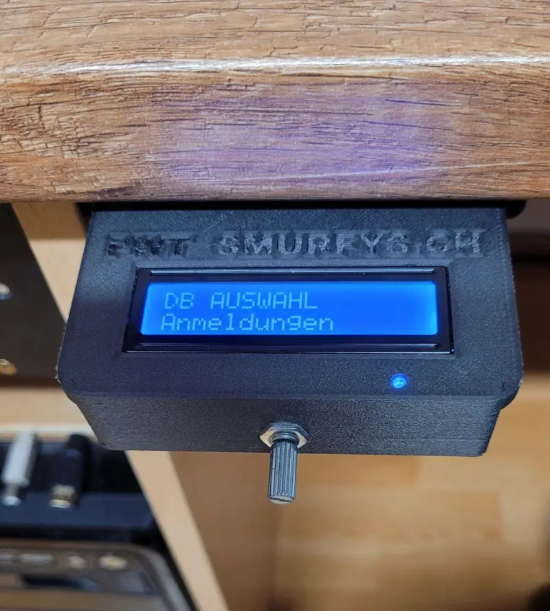

# 密码安全 / 键盘注入器

一个可编程键盘，用于发送密码 /登录凭证/文本......通过 USB 连接连接到 PC。目前已经迭代到第五版了，目标是打造超紧凑型版本和一款可安装在桌面下方的大显示屏版。使用 circuitpython，在 Pico Zero 开发板上编程。

文本以文件形式存储在密码保险箱的内存中。编辑文件时，插入 USB 线时按下旋钮即可。在 USB 连接时按下旋钮时，PC 上会挂载一个 USB 驱动器，为文本文件提供 800MB 的存储空间。这意味着超过 50 万个 ASCII 字符。

有两个密码保险箱版本：一个是带有 OLED 显示屏的迷你版，另一个是配备 1602 I2C LCD 显示屏的更大版本。

## 相关链接

- [完整项目说明](https://www.instructables.com/Password-Safe-Keyboard-Injector-Version-50/)
- [组装说明](https://content.instructables.com/FL6/HEW5/MLVCT7V7/FL6HEW5MLVCT7V7.pdf)
- [用户手册 V5](https://content.instructables.com/FXB/B6QJ/MLRB3EF1/FXBB6QJMLRB3EF1.pdf)
