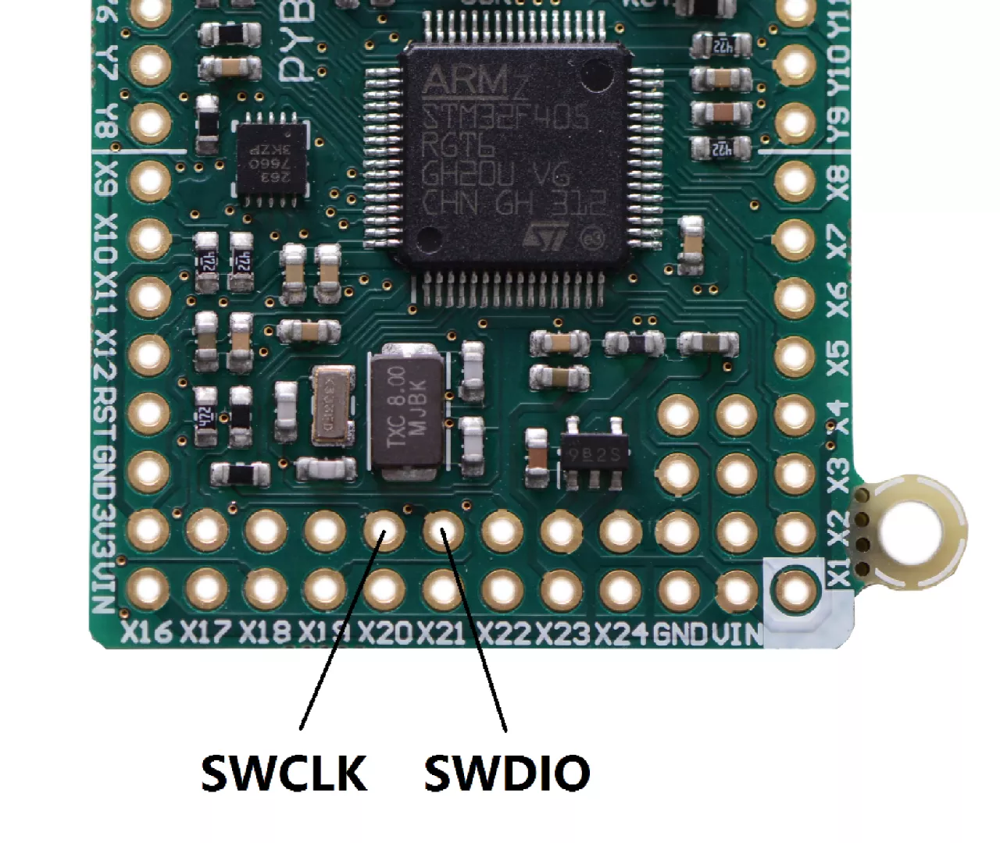
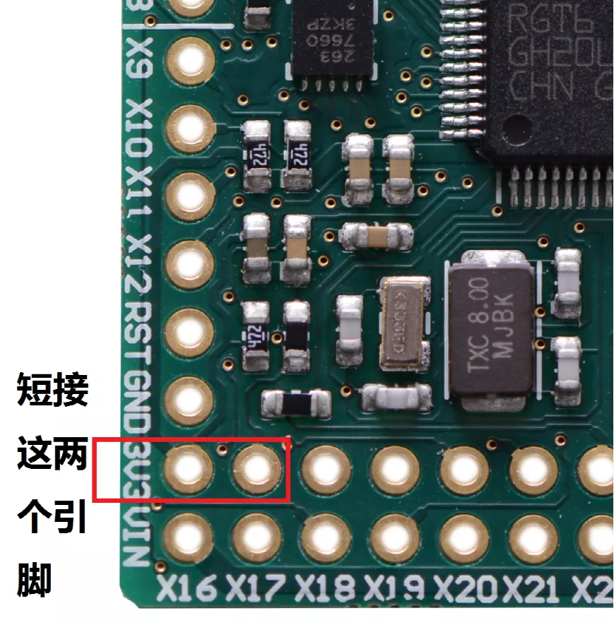
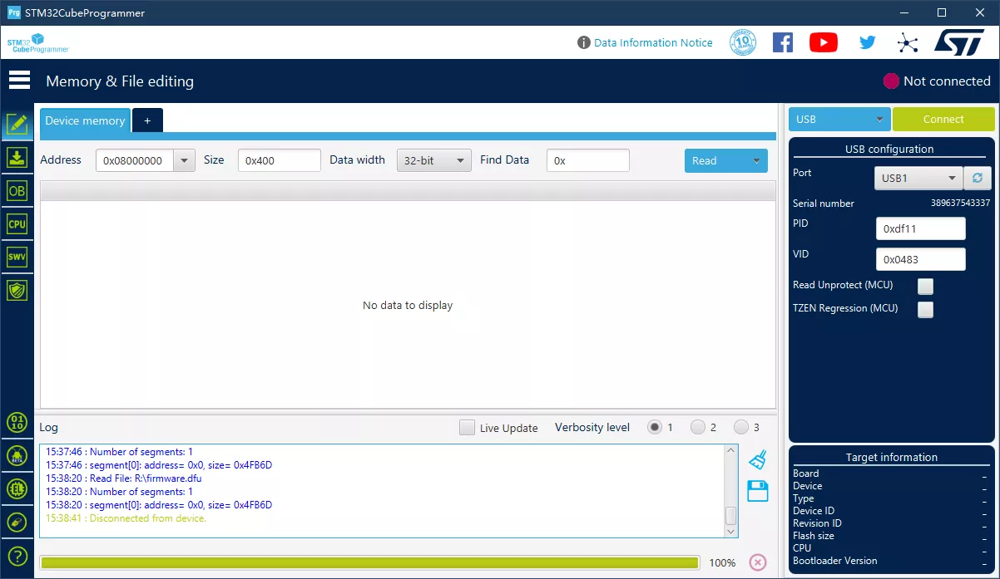
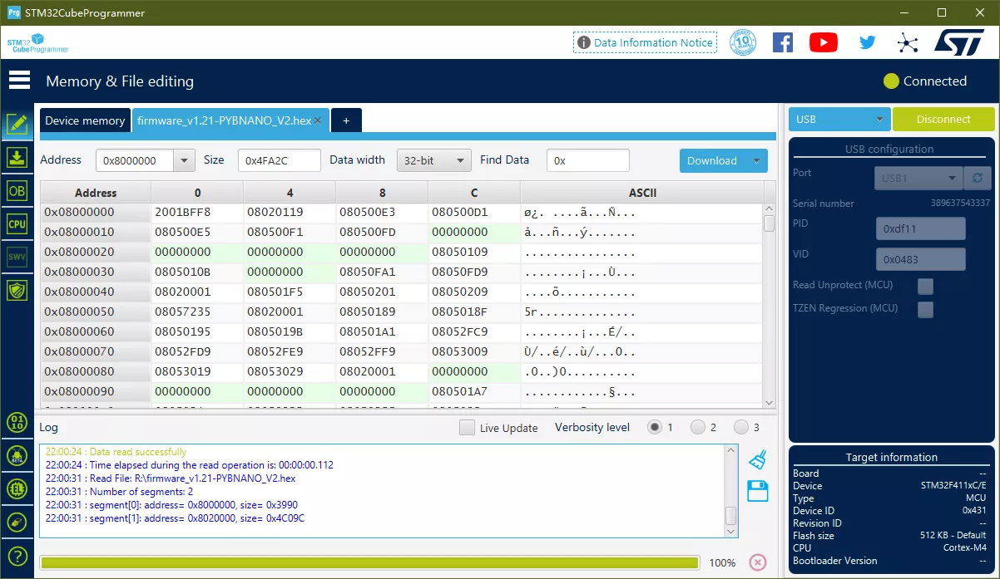
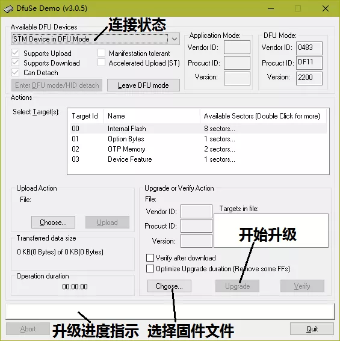
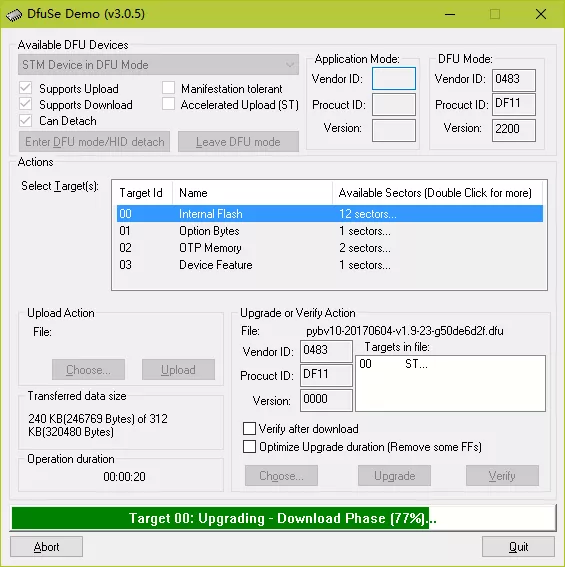
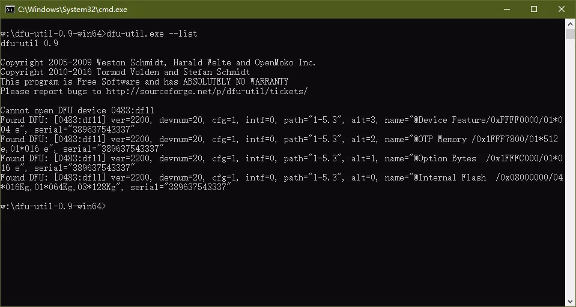
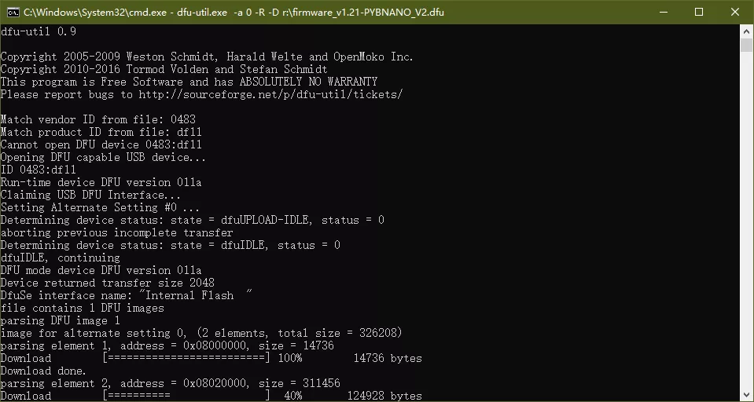

# stm32

pyboard 和其它使用 STM32 的系统，可以使用相同的方法升级固件。升级方法有两种：通过 dfu 或者 SWD 方式。使用 dfu 方式不需要任何额外的硬件，通过 USB 就可以直接升级。而 SWD 方式就是使用仿真器/编程器进行下载，和开发单片机程序时一样。

使用仿真器时，需要将仿真器的 SWD 连接到 pyboard 的 SWD 上，在 PYBV10 上，它对应下图所示的引脚，也就是 PA13/PA14。如果是 Nucleo 开发板，可以通过开发板自带的 ST-Link 直接进行升级。



使用 dfu 模式进行升级时，在 windows 下，可以使用 ST 的 STM32CubeProgrammer 或 DfuSE（DfuSe软件已经停止开发了，但还是可以继续使用），它们可以在 ST 公司的网站上下载（需要先注册或者提供个人邮箱才能下载）。在 ST 网站上搜索 STM32CubeProgrammer 或 DfuSE，就可以快速找到软件。

如果芯片中已安装了 micropython，可以在 REPL 提示符下输入下面命令让 PyBoard 进入 DFU 模式：

```py
pyb.bootloader()
```

如果 PyBoard 中没有包含 micropython 固件（通常是没有写入固件的新模块）或者固件损坏，需要将 BOOT0 连接到 3.3V（参考下图，方框中左边是 3V3，右边是 BOOT0），然后按下复位键，stm32 就会强制进入 DFU 模式。



## 使用 STM32CubeProgrammer 下载固件

STM32CubeProgrammer 是 ST 公司新的芯片编程软件，用于取代原有的 DfuSE、ST-LINK Utility等软件。使用 STM32CubeProgrammer 软件，可以用 Dfu 或 ST-Link 等方式下载程序，使用 ST-Link 时和开发单片机时是一样的（需要连接仿真器），所以这里只介绍 Dfu 方式。

运行软件后，在软件的右上角显示了设备连接（Connect）按钮。先选择 USB 方式，当 STM32 进入 Dfu 模式后，就会显示出可以连接的设备列表，如果没有显示可以点击下拉框旁的刷新按钮，选择设备后点击连接（connect），就可以连接到 stm32。



然后点击左上角的 open file 或者加号，选择 hex 格式的固件（注意这里不能选择 dfu 格式的固件，因为软件不支持 dfu 格式，会将它当作 bin 格式文件处理）。再点击 Download 按钮就可以下载固件了。下载完成后，需要重新上电，。



## 使用 DfuSe 下载固件

如果不需要 STM32CubeProgrammer 的额外功能，或希望直接使用 dfu 格式固件，可以继续使用原有的 DfuSE 软件。运行 DfuSE 软件可以看到下面的界面，软件上方显示了开发板连接状态，如果开发板进入 DFU 模式就会在这里显示出相关信息。右下角的 Choose  用来选择并打开固件文件（dfu 格式），upgrade 按钮启动升级，而下面的进度条会显示升级进度。



没有载入固件文件时，升级（upgrade）按钮是灰色的，无法使用。当我们载入 dfu 固件文件后，升级按钮恢复正常，就可以通过它升级固件了。载入固件文件时要注意不要选择了错误的固件文件，因为软件不会识别芯片型号，也没有错误提示。升级通常需要数十秒时间，升级完成后，可以按下复位键或者重新插拔一次 USB，就可以加载新版本的 micropython 了。



使用 DFU 模式，无需任何额外的硬件设备，利用芯片内部自带的功能实现升级，最简单方便。

与 DfuSE 相比，STM32CubeProgrammer 的功能更多体积更大，但如果只是为了升级 micropython 固件，DfuSE 可能更容易使用。另外需要注意的是，DfuSE 和 STM32CubeProgrammer 两个软件的设备驱动程序不同，因此最好不要同时安装。如果安装了其中一个软件又想使用另外一个软件，就需要彻底删除原有的设备驱动程序重新安装驱动，否则会找不到设备。

## 使用 dfu-util 升级固件

STM32CubeProgrammer 或 DfuSE 都是标准的 windows 程序，有些情况下需要在Linux 或命令行中下载固件，可以使用 dfu-util 这个软件。先到软件的网站下载对应的执行文件，网址是：

https://dfu-util.sourceforge.net/releases/

下面以 windows 版本为例进行说明。目前 Windows 软件的最后版本是 dfu-util-0.9-win64.zip，将下载的文件解压缩，在命令行下运行其中的 dfu-util.exe。软件有多个命令行参数，我们常用的只有两个：查看设备列表和下载程序。

- `dfu-util.exe -list`

  查看系统中 dfu 设备。一个设备会显示 4 行，代表芯片内部 4 个不同的 flash 区，我们需要使用的 Internal Flash，通常也就是 0。
  
  
<br>

- `dfu-util.exe -a 0 -D 固件文件名`

  使用 -D 参数下载指定 dfu 文件到内部 flash，-a 0 代表芯片的 Internal Flash 区。
  
    
  
## Linux 下升级固件

如果是在 linux 下升级固件，可以在编译源码时，指定编译参数进行升级（不需要安装 dfu-util，设备要进入 dfu 模式），如：

`$ sudo make BOARD=PYBV10 deploy`

或者直接使用 dfu-util 进行升级，比如：

`$ sudo dfu-util -a 0 -d 0483:df11 -D build-PYBV11/firmware.dfu`

