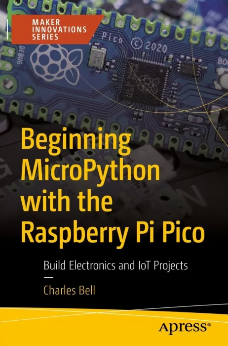

# Beginning MicroPython with the Raspberry Pi Pico（从Raspberry Pi Pico开始MicroPython）

使用MicroPython对Raspberry Pi Pico（来自raspberrypi.org的最新微控制器开发板）进行编程。本书将带您参观Raspberry Pi Pico，包括如何开始使用微控制器，了解可用的替代微控制器，以及如何连接和运行简单的代码示例。

您将在PC上使用Python作为学习平台，在MicroPython中编写示例项目。然后，通过电子和面包板电路建立你的硬件技能。您将实施示例项目，并解释所有步骤，包括硬件连接和执行项目。然后使用可访问的Raspberry Pi Pico将它们应用于现实世界中易于接近的项目！

这本书展示了云是如何用于物联网数据的，并找出目前物联网的流行云系统。最后，您将使用ThingSpeak来托管物联网数据，包括将Pico连接到互联网。

从Raspberry Pi Pico开始学习MicroPython，可以让你建立更高级的物联网项目和云系统的技能！

你将学到什么

- 使用MicroPython培养有价值的编程技能
- 探索Raspberry Pi Pico和类似的板
- 开发自己的电子和物联网项目
- 将Grove组件系统与Raspberry Pi Pico结合使用

这本书是写给对微控制器上使用MicroPython使用Raspberry Pi Pico感兴趣的初学者，在编程、硬件或电子方面几乎没有经验。这本书也应该吸引那些想获得用微控制器构建电子解决方案经验的人。

## 购买链接

- [亚马逊](https://www.amazon.com/Beginning-MicroPython-Raspberry-Pico-Electronics/dp/1484281349)
- [京东](https://item.jd.com/10055994206790.html)
