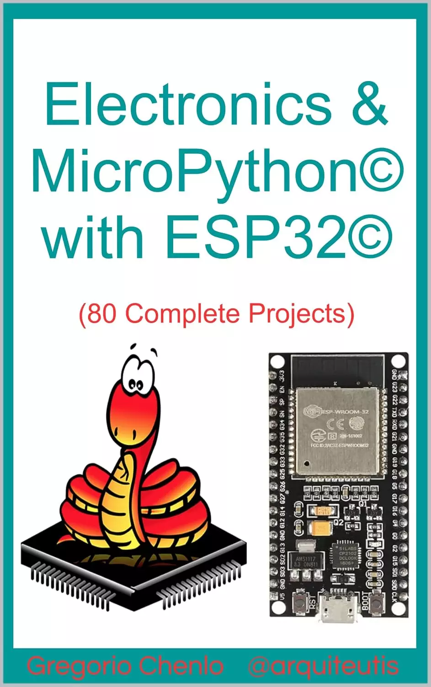

# 电子与MicroPython©与ESP32©：80个完整项目 (Electronics & MicroPython© with ESP32©: 80 complete projects)

电子和MicroPython©与ESP32©

他们给了你一个ESP32©，而你不知道该怎么办？：本书详细解释了您需要哪些基本硬件和软件，以便您可以将ESP32©与MicroPython©一起用作培训语言或开发各种有用且有趣的项目。你可以很容易地学会用这种伟大的语言编写程序，一个接一个地学习基本命令，加载其他用户已经测试过的库，享受多个示例，这样你就可以最终设计和控制自己的项目。您还将学习基本的模拟和数字电力和电子，详细一步一步地解释，基础知识，组件，芯片，设备，传感器，执行器，以及数百种图形，配色方案，所有这些都是英文的。

你想知道如何使用Python©编程语言构建一个简单的项目，却不知道从哪里开始吗？：本书从头开始教你基本的MicroPython©，详细解释了程序的结构、各种指令、外部库的导入、函数的设计、错误控制等，以及如何创建简单的项目和程序，没有复杂性，易于遵循，在愉快有趣的环境中。

您是否已经拥有ESP32©，已经了解Python©并希望从中获得更多？：本书指导您如何使用专业工具、WAV和MP3声音、WiFi或蓝牙连接、与IFTTT©的家庭自动化集成、Web服务器、数十个传感器、波形发生器、PWM、伺服系统、网络文件共享、SD卡记录等来增强知识并开发更完整和复杂的项目。

你喜欢电子产品及其与家庭自动化的集成，但你不知道该怎么做吗？：在本书中，您有机会学习使用MicroPython©编程，使用ESP32©、Home Assistant©和ESPHome©来控制电子设备，并通过多种功能增强您的项目。

其中包括80个完整的项目和另外400个拟议的练习，在阅读本书后，这些练习将帮助你掌握ESP32©的MicroPython©环境，并花了一些时间娱乐，其中试错过程是扎实学习的基础。

更多信息请访问：gregochenlo.blogspot.com

1.-HARDWARE
2.-SOFTWARE
3.-MICROPYTHON©
- The interpreter Thonny©
- The art of programming
- Structure of a program
- Importing libraries
- Comments
- Parameters & variables
- Type of data
- Input & output
- Operators
- Flow control
- User functions
- Predefined functions
- Files
- Error control
- Command summary

4.-EXERCISES
- E1: Turn on/off an LED
- E2: SOS signal with LED
- E3: DC10EGWA© level indicator
- ...
- E20: RGB LED and PWM
- E21: Fan and ESP32© temperature
- E22: L293D© DC motor control
- E23: SG90© servo control
- ...
- E40: TCS3200© colors sensor
- E41: KY-032© obstacle sensor
- E42: 1838B© infrared receiver
- E43: Remote control with infrared
- ...
- E60: Alternating current sensor
- E61: Send email with ESP32©
- E62: Home Automation with IFTTT©
- E63: NO-IP© remote management
- E64: ADXL345© accelerometer
- ...
- E70: 74HC595© 8 LED manager
- E71: SMA42056© 6 segments display
- E72: 4x7 segment cascade display
- E73: LCD1602© I2C display
- E74: LCD1602© display with PCF8574©
- E75: ILI9341© TFT display
- ...
- E80: MAX7219© LED matrix display

5.-ADDITIONAL SOFTWARE
6.-MORE INFORMATION
- Python2© vs Python3©
- Interruptions managed by the ESP32©
- IFTTT©
- Home Assistant© and ESPHome
- MB-102© power supply
- Eagle©

## 购买链接

- [亚马逊](https://www.amazon.com/-/zh/dp/B0DHPSS51J/143-9594968-3292431)
