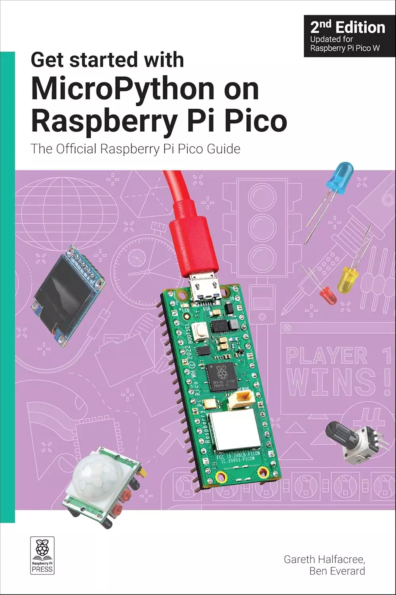

# Get started with MicroPython on Raspberry Pi Pico: The Official Raspberry Pi Pico Guide（开始在Raspberry Pi Pico上使用MicroPython：官方Raspberry Pi Pico指南）

为家庭项目、工业自动化或学习（或教学！）电子和编程创建自己的可编程电子装置。​

学习如何使用初学者友好的MicroPython语言编写程序和连接硬件，使您的Raspberry Pi Pico与周围的世界互动。使用这些可编程连接，您可以点亮LED、发出噪音、向屏幕发送文本等等。​

本书针对Raspberry Pi Pico 2和2 W以及最新版本的MicroPython进行了全面更新，向您展示了如何：

- 开始使用Raspberry Pi Pico 2和Pico 2 W，以及最初的Pico和Pico W​
- 使用各种电子元件​
- 创建自己的可编程电子装置​
- 将Pico 2 W转变为物联网的网络连接节点​
- 使用蓝牙低功耗（BLE）将Pico 2 W连接到智能手机、平板电脑或其他Pico 2 W

**目录**：

- 第1章：了解你的Raspberry Pi Pico
- 第2章：MicroPython编程
- 第3章：物理计算
- 第4章：使用Raspberry Pi Pico进行物理计算
- 第5章：交通灯控制器
- 第6章：反应游戏
- 第7章：防盗警报
- 第8章：温度计
- 第9章：数据记录器
- 第10章：数字通信协议：I2C和SPI
- 第11章：与Pico W的Wi-Fi连接
- 第12章：与Pico W的蓝牙连接
- 附录A：Raspberry Pi Pico规格
- 附录B：引脚指南
- 附录C：可编程输入/输出

## 购买链接

- 亚马逊
  - [第一版](https://www.amazon.com/-/zh/dp/1912047861)
  - [第二版](https://www.amazon.com/-/zh/dp/1912047292)
- [京东](https://item.jd.com/10139247317129.html)
