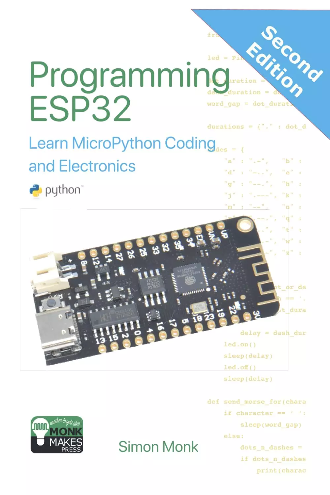

# Programming ESP32: Learn MicroPython Coding and Electronics (MonkMakes Embedded Programming)（ESP32编程：学习MicroPython编程和电子学）

这本书将教你Python编程和一些基本的电子学，而不假设你对这两门学科都有任何先验知识。这本书最初侧重于Python编程，构建了一个莫尔斯电码示例。

这本书适用于大多数ESP32板，但主要关注最受欢迎的ESP32 Lite和ESP32 DevKit 1。在关于电子的章节中，为这两个板提供了面包板布局。第二版新增了关于蓝牙低功耗的内容。

了解如何：

- 将Python固件闪存到ESP32板上
- 安装并使用Thonny Python编辑器，并将程序上传到ESP32
- 用Python编写简单的程序来控制ESP32
- 用函数和模块构建程序
- 有效利用Python列表和字典
- 将传感器、LED、显示器和伺服电机连接到ESP32并对其进行编程
- 利用ESP32的WiFi和蓝牙功能将ESP32用作web服务器，并在互联网上调用web服务

## 购买链接

- [亚马逊](https://www.amazon.com/-/zh/dp/1739487494)
- [京东](https://item.jd.com/10211224636128.html)
