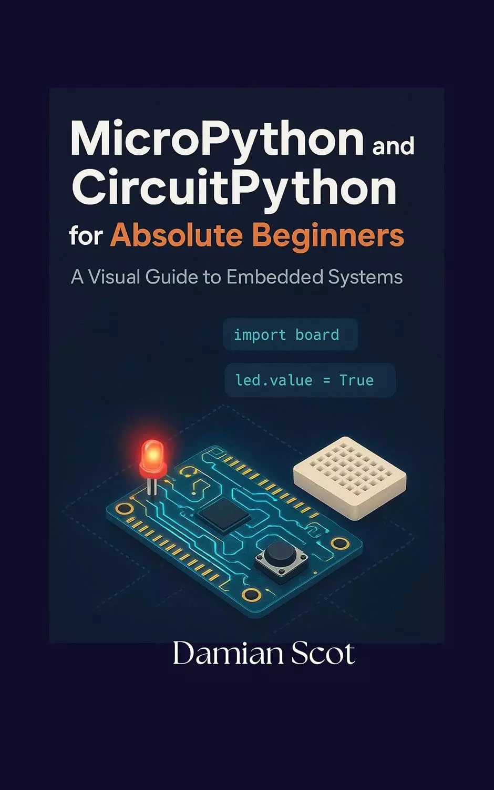

# 面向绝对初学者的MicroPython和CircuitPython：嵌入式系统可视化指南 (MicroPython and CircuitPython for Absolute Beginners : A Visual Guide to Embedded Systems )

准备好将你的想法变为现实并构建小工具了吗？

面向绝对初学者的MicroPython和CircuitPython：嵌入式系统可视化指南是您通往激动人心的电子和编码世界的友好、全面的路线图。这不仅仅是另一本教科书；这是一个直观实用的指南，旨在让你从第一页开始构建很酷、功能强大的项目。

忘掉枯燥的技术术语吧。这本书将清晰、简洁的解释与温暖、对话的语气和个人见解相结合，使复杂的概念易于理解。我们从绝对的基础知识开始，逐步提高，确保您建立坚实的知识基础。

在本书中，您将学习如何：

- **与世界互动**：读取按钮按下和传感器的模拟信号，以了解您的环境。
- **创建动态输出**：使用脉宽调制（PWM）精确控制灯光、声音和电机。
- **构建交互式设备**：结合输入和输出，创建响应命令的项目。
- **连接到物联网（IoT）**：掌握Wi-Fi连接，并使用API构建可从任何地方访问的网络控制设备。
- **设计和构建永久性项目**：从面包板转向定制电路，用电池为您的创作供电。

这本书非常适合业余爱好者、学生和任何对电子和编程有好奇心的人。有了“MicroPython和CircuitPython for Absolute Beginners”，你不仅可以学习嵌入式系统，还可以构建它们。

今天就开始你的创客之旅，把你的想象变成现实！

## 购买链接

- [亚马逊](https://www.amazon.com/-/zh/dp/B0FMSBNWJG/143-9594968-3292431)

