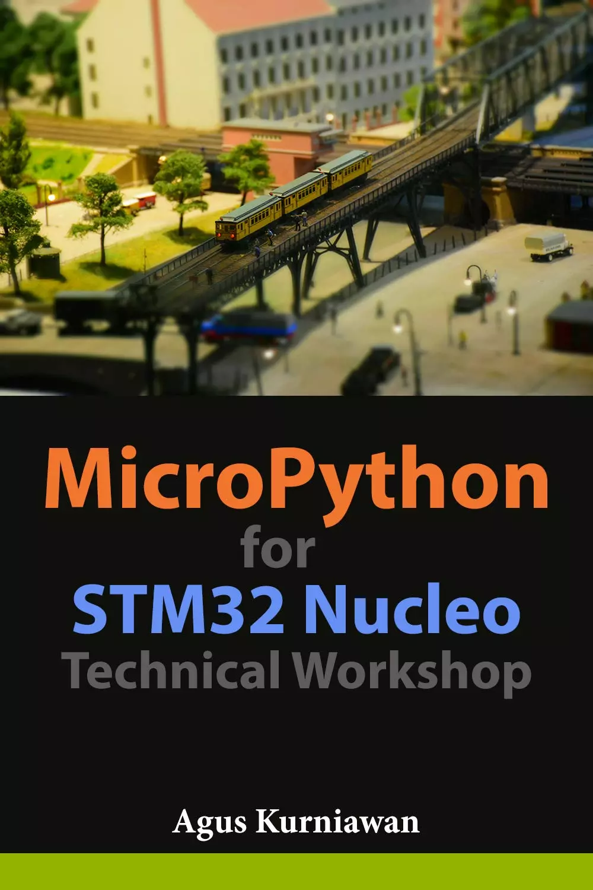

# STM32 Nucleo 开发板 MicroPython 技术研讨会 (MicroPython for STM32 Nucleo Technical Workshop)

本书探讨了在 STM32 Nucleo 开发板上使用 MicroPython 进行编程。一些基本的开发是循序渐进的，以下是本书的主题列表：
* 准备开发环境
* 为STM32 Nucleo设置MicroPython
* GPIO编程
* PWM和模拟输入
* 使用I2C
* 使用UART
* 使用SPI
* 使用DHT模块

## 购买链接

- [亚马逊](https://www.amazon.com/-/zh/dp/B07HPFCXJC)
