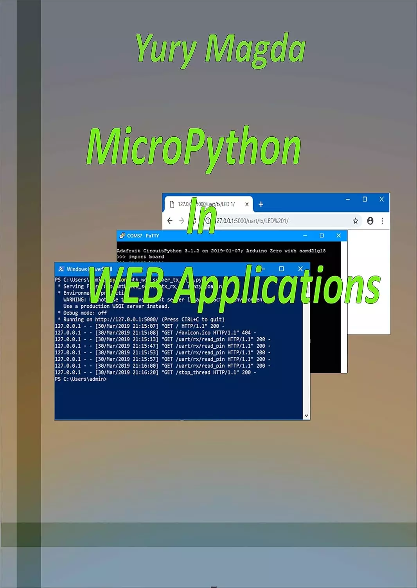

# WEB应用程序中的MicroPython (MicroPython In WEB Applications)

如今，MicroPython 及其衍生的 CircuitPython 编程语言在嵌入式系统中得到了广泛的应用。这两种工具都经过优化，可以在各种微控制器开发板和套件上运行。MicroPython 和 CircuitPython 为中断、定时器、LED、ADC、DAC、PWM和其他外围设备提供了高级方便的接口。

本指南描述了如何使用名为Flask的流行WEB框架通过WEB控制在MicroPython/CircuitPython中开发的嵌入式系统。

Flask是一个小框架，通常被称为“微框架”。尽管Flask缺乏成熟的WEB应用程序框架中常见的大部分功能，但它便于接收HTTP请求，将HTTP请求路由到适当的控制器，调度控制器并返回HTTP响应。借助Flask微框架，我们可以轻松构建能够驱动微控制器板硬件的WEB服务器。
虽然这本书假设你之前没有Flask知识，但假设你有一定程度的Python编码经验，并了解Python的基本概念，如包、模块、函数、装饰器等。

本书由一位在嵌入式系统设计方面拥有20多年经验的专业嵌入式工程师撰写。

## 购买链接

- [亚马逊](https://www.amazon.com/-/zh/dp/B07QCJ5NJW)
