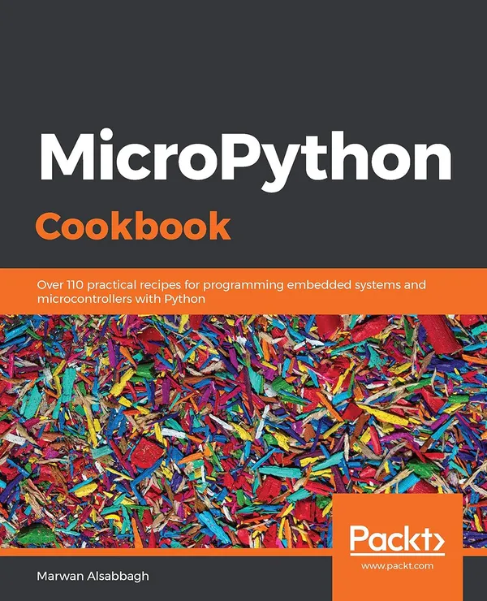

# MicroPython Cookbook: Over 110 practical recipes for programming embedded systems and microcontrollers with Python

## 主要特点

- 使用 MicroPython 执行您的第一个程序
- 使用 RESTful API 对物联网设备进行编程以检索天气数据
- 掌握将硬件、编程和网络概念与 MicroPython 集成

## 书籍描述

MicroPython 是在嵌入式环境中运行的Python 3的开源实现。使用MicroPython，您可以编写干净简单的Python代码来控制硬件，而无需使用复杂的低级语言，如C和C++。本书将指导您了解MicroPython平台的所有主要应用程序，以构建和编程使用微控制器的项目。

这本MicroPython书涵盖了一些食谱，这些食谱将帮助你尝试用MicroPython编程的编程环境和硬件。你会发现构建各种物体和原型的技巧和技术，这些物体和原型可以感知和响应触摸、声音、位置、热量和光线。本书将带您了解MicroPython与各种流行输入设备和传感器的使用。您将学习处理时间延迟和传感器读数的技术，并应用先进的编码技术来创建复杂的项目。随着您的进步，您将处理物联网（IoT）设备以及与其他在线web服务的集成。除此之外，您将使用MicroPython用香蕉制作音乐，并创建将声音和灯光动画融入游戏中的便携式多人视频游戏。

到本书结束时，您将掌握解决开发问题的技巧和窍门，并将MicroPython项目提升到一个新的水平。

## 你将学到什么

- 使用REPL执行代码，无需编译或上传（读取-评估-打印循环）
- 对LED矩阵和NeoPixel驱动器进行编程和控制，以显示图案和颜色
- 构建利用光、温度和触摸传感器的项目
- 配置设备以创建Wi-Fi接入点，并使用网络模块扫描和连接到现有网络
- 使用脉宽调制来控制直流电机和伺服系统
- 构建一个物联网设备，只需按一下按钮即可显示来自互联网的实时天气数据

## 这本书是给谁的

如果你想构建和编程使用微控制器的项目，这本书将为你提供数十个食谱，指导你完成MicroPython平台的所有主要应用程序。虽然不需要了解MicroPython或微控制器，但要开始阅读本书，需要对Python有一个大致的了解。

## 目录

- 开始使用MicroPython
- 控制LED
- 创造声音和音乐
- 与按钮交互
- 读取传感器数据
- 按钮Bash游戏
- 果味曲调
- 让我们行动起来，行动起来
- 在micro:bit上编码
- 控制ESP8266
- 与文件系统交互
- 网络
- 与Adafruit FeatherWing OLED互动
- 构建物联网天气机器
- Adafruit HalloWing的编码

## 购买链接

- [亚马逊](https://www.amazon.com/MicroPython-Cookbook-practical-programming-microcontrollers-ebook/dp/B07QXT664P)
- [京东](https://item.jd.com/10181951282709.html)
- [配套代码](https://github.com/PacktPublishing/MicroPython-Cookbook)

