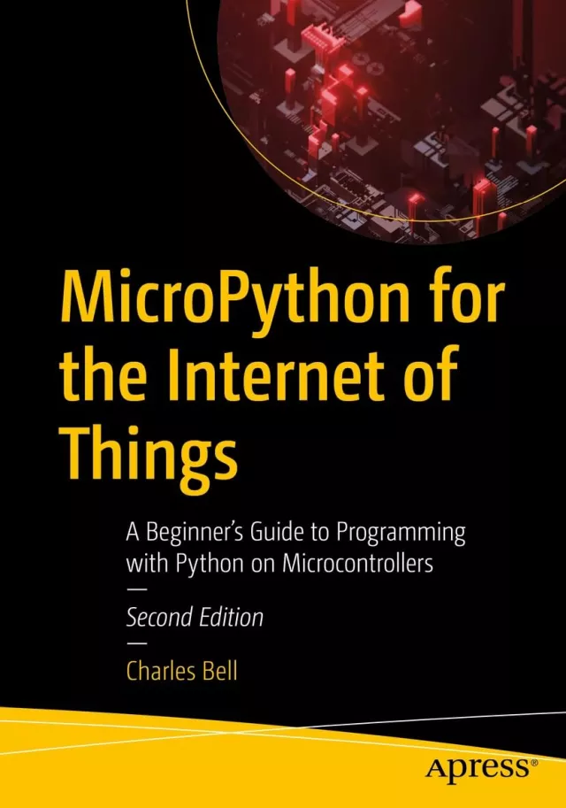

# MicroPython for the Internet of Things: A Beginner’s Guide to Programming with Python on Microcontrollers（用于物联网的MicroPython：在微控制器上使用Python编程的初学者指南）

这本书将帮助您快速学习微控制器和物联网设备的编程，而无需大量的学习和花费。MicroPython和支持它的控制器消除了使用类C语言编程的需要，使物联网应用程序和设备的创建比以往任何时候都更容易、更容易访问。 

MicroPython for Internet of Things是电子和物联网领域新手的理想选择。提供的具体示例涵盖了一系列支持的设备、传感器和MicroPython板，如Raspberry Pi Pico和Arduino Nano Connect RP2040板。微控制器的编程从未如此简单。

这本书采用了一种实用和动手的方法，没有走太多弯路深入理论。它将向您展示一种更快、更简单的方法来编程微控制器和物联网设备，教您MicroPython，这是最广泛使用的脚本语言之一的变体，并且是为电子新手编写的。完成本书及其有趣的示例项目后，您将准备好使用MicroPython开发自己的物联网应用程序。

## 你将学到什么

MicroPython程序
- 了解传感器和基本电子设备
- 开发自己的物联网项目

为Raspberry Pi Pico和Arduino Nano Connect RP2040等流行板构建应用程序
- 在兼容板上加载MicroPython
- 与硬件转接板的接口

通过MicroPython将硬件连接到软件
- 探索将微控制器连接到云端
- 为云开发物联网项目

## 这本书是写给谁的

任何对构建物联网解决方案感兴趣而不需要用C++或C编程的人。这本书也吸引了那些想要一种比需要更复杂编程环境的平台更容易使用硬件的人。

## 购买链接

- [亚马逊](https://www.amazon.com/MicroPython-Internet-Things-Programming-Microcontrollers-ebook/dp/B0CRGM5QMQ)
- 京东
  - [原版](https://item.jd.com/10098637372994.html)
  - [翻译版](https://item.jd.com/10116840563692.html)
