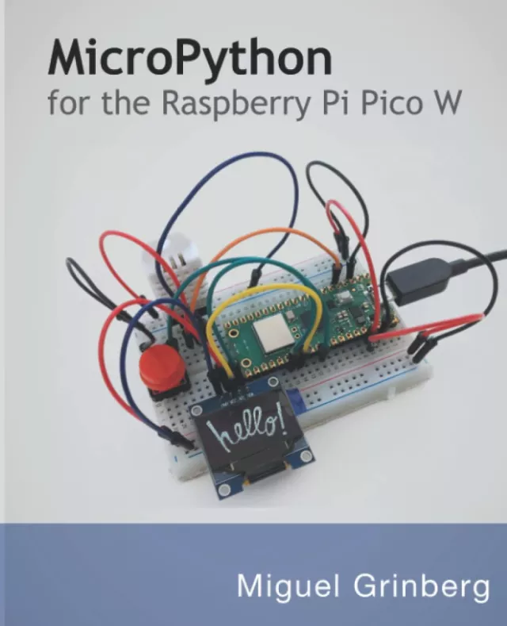

# 用于Raspberry Pi Pico W的MicroPython：用Python编程数字电路的介绍 (MicroPython for the Raspberry Pi Pico W: A gentle introduction to programming digital circuits with Python)

欢迎阅读Raspberry Pi Pico W的MicroPython，这本书将向您介绍微控制器和小型互联网设备的激动人心的世界，现在已针对流行的Raspberry Pi Pico W微控制器板进行了修订和改编，这是一种廉价但功能强大的设备。就软件而言，选择的语言是MicroPython，这是Python语言的轻量级版本，旨在在资源有限的设备上运行。通过本书，您将学习如何创建利用Wi-Fi、传感器、屏幕和按钮的数字电路，所有这些都使用不需要焊接的“即插即用”方法，并使用熟悉的Python语言进行编程。

## 购买链接

- [亚马逊](https://www.amazon.com/MicroPython-Raspberry-Pico-introduction-programming/dp/B0BKSCV18D)
