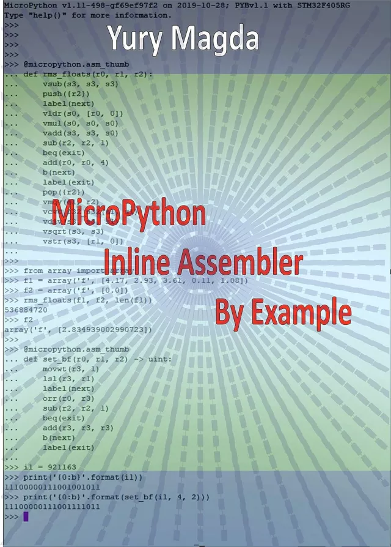

# MicroPython内联汇编程序示例 (MicroPython Inline Assembler By Example)

这本书适合任何想学习如何使用内联汇编编写高性能MicroPython应用程序的人。高级代码与低级内联汇编器指令相结合，可以开发高性能应用程序。这本书的材料被认为是一本非常实用的指南，其中包含了许多示例，说明了使用Inline Assembler的许多方面。所有内联汇编器示例都是为基于STM32微控制器的流行板开发的，因此假设读者了解Cortex-M微控制器的基础知识。

代码示例是使用流行的Pyboard v1.1（PyBv1.1）开发板开发和测试的，该开发板在www.micropython.org上有详细描述。尽管如此，所有示例都可以很容易地适用于任何配备STM32Fxx MCU的micropython开发板。

本书由一位在嵌入式系统设计方面拥有20多年经验的专业嵌入式工程师撰写。

## 购买链接

- [亚马逊](https://www.amazon.com/MicroPython-Inline-Assembler-Example-Magda-ebook/dp/B07ZQLSJHF)

