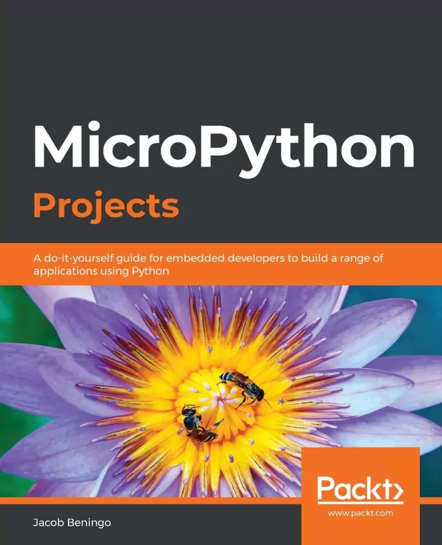

# MicroPython Projects: A do-it-yourself guide for embedded developers to build a range of applications using Python（MicroPython项目：嵌入式开发人员使用Python构建应用程序的自助指南）

## 主要特点

- 深入研究MicroPython内核，学习如何进行修改以增强您的嵌入式应用程序
- 设计和实现与各种传感器和设备交互的驱动程序
- 利用机器学习构建DIY自动化和物体检测等低成本项目

## 书籍描述

随着过去几年嵌入式系统复杂性的增加，开发人员正在寻找通过解决问题来轻松管理它们的方法，而无需花费大量时间寻找支持的外围设备。MicroPython是Python 3编程语言的高效和精益实现，经过优化可以在微控制器上运行。MicroPython项目将指导您轻松构建和管理嵌入式系统。

本书是一本全面的基于项目的指南，将帮助您构建广泛的项目，并让您有信心设计跨越电子应用、自动化设备和物联网应用等新技术领域的复杂项目。在构建七个引人入胜的项目时，您将学习如何使设备能够相互通信，通过TCP/IP套接字访问和控制设备，以及存储和检索数据。随着您从事不同的项目，复杂性将逐渐增加，涵盖驱动程序设计、传感器接口和MicroPython内核定制等领域。

在这本MicroPython书的结尾，你将能够开发符合行业标准的嵌入式系统，并跟上物联网的发展。

## 你将学到什么

- 使用MicroPython开发嵌入式系统
- 构建自定义调试工具，实时可视化传感器数据
- 使用机器学习和MicroPython检测对象
- 了解如何最大限度地降低项目成本并缩短开发时间
- 掌握手势操作和解析手势数据
- 了解如何自定义和部署MicroPython内核
- 探索调度应用程序任务和活动的技术

## 这本书是给谁的

如果你是一名嵌入式开发人员或业余爱好者，希望使用MicroPython构建有趣的项目，这本书适合你。需要对电子和Python有基本的了解，而一些MicroPython经验会有所帮助。

## 目录

- 使用MicroPython深入兔子洞
- 管理实时任务
- 为I/O扩展器编写MicroPython驱动程序
- 开发应用程序测试工具
- 自定义MicroPython内核启动代码
- 一种可视化传感器数据的自定义调试工具
- 使用手势进行设备控制
- 使用Android的自动化和控制
- 使用机器学习构建目标检测应用程序
- MicroPython的未来
- 附录A-下载和运行MicroPython代码

## 购买链接

- [亚马逊](https://www.amazon.com/MicroPython-Projects-do-yourself-applications/dp/1789958032)
- 京东
  - [原版](https://item.jd.com/10026564544984.html)
  - [翻译版](https://item.jd.com/10228905501112.html)
