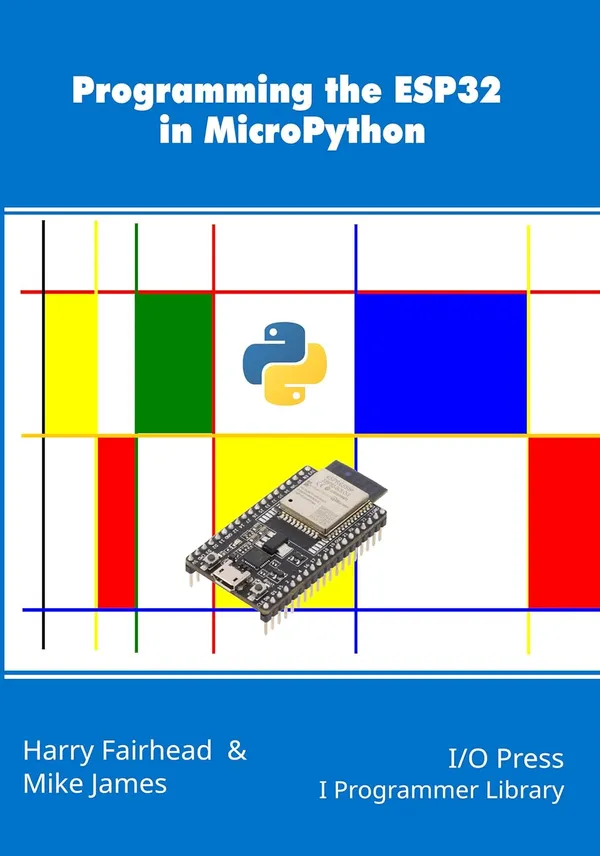

# Programming the ESP32 in MicroPython（用MicroPython编程ESP32）

第二版新增了对ESP32 S3和Arduino Nano ESP32的支持。

ESP32是一款出色的设备。它的成本很低，但有许多不同的子系统，使其比你想象的更强大。你可以把它用于简单的应用程序，因为它很便宜，但你也可以把它用在更复杂的应用程序中，因为它功能强大。

MicroPython是编写ESP32的良好语言选择。虽然它比C语言慢，但大多数时候这并不重要，而且它更容易使用。作为一种高级语言，MicroPython基于Python 3，完全面向对象。一般来说，你可以使用现有的Python 3程序，并在MicroPython下运行它。如果要做任何更改，通常都是很小的。

ESP32上的MicroPython的另一个好处是它很容易上手。经过一个简单的安装过程，你就有了一台可以工作的MicroPython机器，你几乎可以使用Thonny IDE或PyCharm一次编程，PyCharm具有更广泛的语法检查和输入提示。

本书的目的是揭示您可以使用ESP的GPIO线以及广泛使用的传感器、伺服系统、电机和ADC做些什么。在介绍了GPIO、输出和输入、事件和中断之后，它为您提供了PWM（脉宽调制）、SPI总线、I2C总线和1-Wire总线的实践经验。我们还涵盖了直接访问硬件、添加SD卡读卡器、睡眠状态以节省电力、RTC、RMT和触摸传感器，更不用说如何使用WiFi了。

本书由Harry Fairhead和Mike James共同撰写，将Harry在电子和物联网方面的专业知识与Mike对Python的知识相结合。他们的其他合作包括在MicroPython中编程Raspberry Pi Pico/W，使用GPIO Zero在Python中编程树莓派IoT，以及使用Linux驱动程序在Python中编写树莓派物联网。

Harry Fairhead是《使用Arduino库用C编程ESP32》、《使用Espressif IDF用C编程ESP 32》以及《Raspberry Pi和Pico》等书籍的C语言对应物的作者。他也是《Fundamental C:越来越接近机器并将C应用于Linux的物联网》一书的作者。

Mike James是《程序员的Python：完全不同的东西》系列书籍和I程序员库中其他几本编程和计算机科学书籍的作者。

## 购买链接

- 亚马逊
  - [第一版](https://www.amazon.com/Programming-ESP32-MicroPython-Harry-Fairhead-ebook/dp/B0C8NV75TF)
  - [第二版](https://www.amazon.com/-/zh/dp/B0DSSVDV76/143-9594968-3292431)
- [京东](https://item.jd.com/10136474806843.html)
