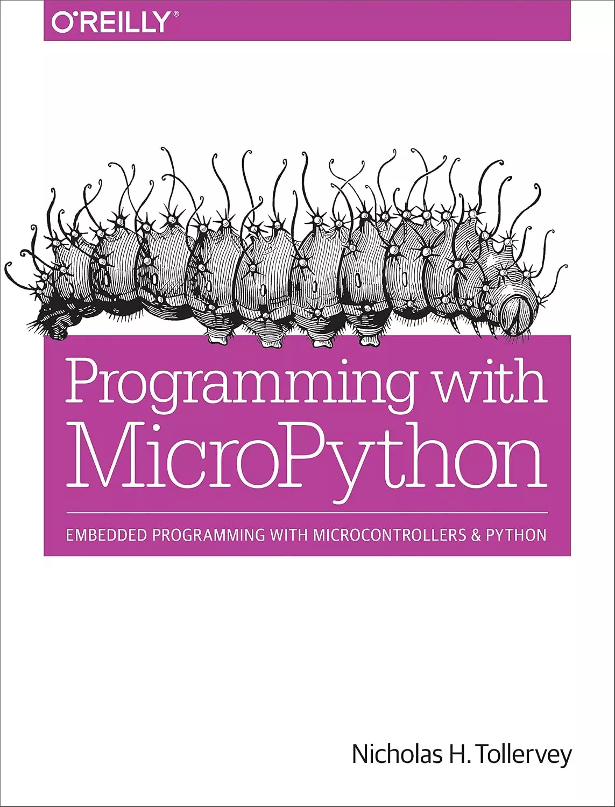

# Programming with MicroPython（用MicroPython编程）

现在是参与MicroPython的激动人心的时刻，MicroPython是Python 3在微控制器和嵌入式系统中的重新实现。本实用指南提供了您所需的知识，让您卷起袖子，用这种简洁高效的编程语言创建出色的嵌入式项目。如果你作为一名程序员、教育家或创客熟悉Python，那么你就已经准备好学习了，并且一路上都很有趣。

作者Nicholas Tollervey将带您踏上从第一步到高级项目的旅程。您将探索运行MicroPython的设备类型，并研究该语言如何使用硬件并与硬件交互来处理输入、连接到外部世界、无线通信、制作声音和音乐以及驱动机器人项目。

* 在四种典型设备上使用MicroPython：PyBoard、micro:bit、Adafruit的Circuit Playground Express和ESP8266/ESP32板
* 探索一个框架，帮助您生成、评估和发展解决实际问题的嵌入式项目
* 深入了解实用的MicroPython示例：视觉反馈、输入和传感、GPIO、网络、声音和音乐以及机器人
* 了解惯用的MicroPython如何帮助您以最少的资源表达大量内容
* 下一步，加入Python社区

## 购买链接

- [京东](https://item.jd.com/25161678471.html)
- [oreilly](https://www.oreilly.com/library/view/programming-with-micropython/9781491972724/)
