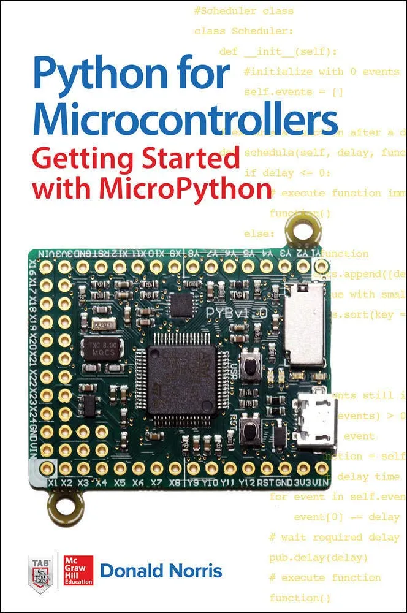

# 微控制器Python：MicroPython入门 (Python for Microcontrollers: Getting Started with MicroPython)

轻松编写自己的MicroPython项目 —— 无需编程经验！

本DIY指南提供了使用MicroPython进行微控制器编程的实用介绍。由一位经验丰富的电子爱好者编写的《微控制器Python：MicroPython入门》包含八个从头到尾的项目，清楚地演示了每种技术。您将学习如何使用传感器、存储数据、控制电机和其他设备，以及如何使用扩展板。从那里，你会发现如何设计、构建和编程各种有趣和实用的项目。

* 学习MicroPython和面向对象编程基础知识
* 探索Pyboard、ESP8266和WiPy的强大功能
* 与PC连接并加载文件、程序和模块
* 使用LED、定时器和转换器
* 使用串行接口和PWM控制外部设备
* 使用3轴加速计构建和编程一个接球检测器
* 安装和编程LCD和触摸传感器扩展板
* 使用AMP音频板录制和播放声音

## 购买链接

- [亚马逊](https://www.amazon.com/Python-Microcontrollers-Getting-Started-MicroPython/dp/1259644537/)
- [京东](https://item.jd.com/11150657321.html)
