# 相关书籍

MicroPython 编程方面的相关书籍。

* micropython入门指南  [京东](https://item.jd.com/12281258.html)

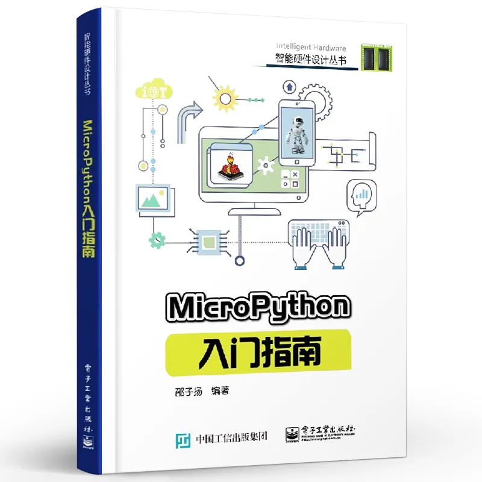

* [Programming with MicroPython](https://www.oreilly.com/library/view/programming-with-micropython/9781491972724/)  [京东](https://item.jd.com/25161678471.html)

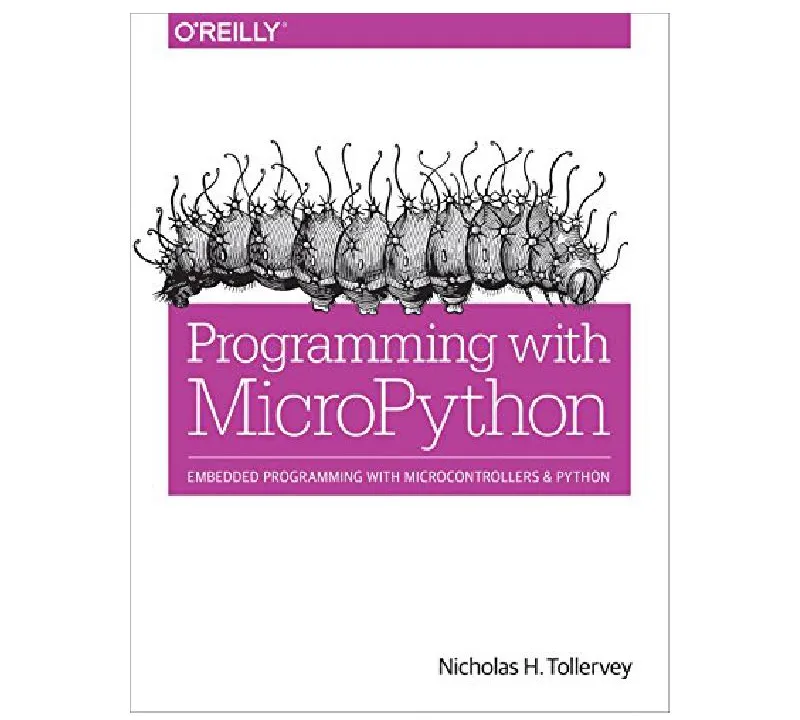

* [Python for Microcontrollers: Getting Started with MicroPython](https://www.amazon.com/Python-Microcontrollers-Getting-Started-MicroPython/dp/1259644537/)

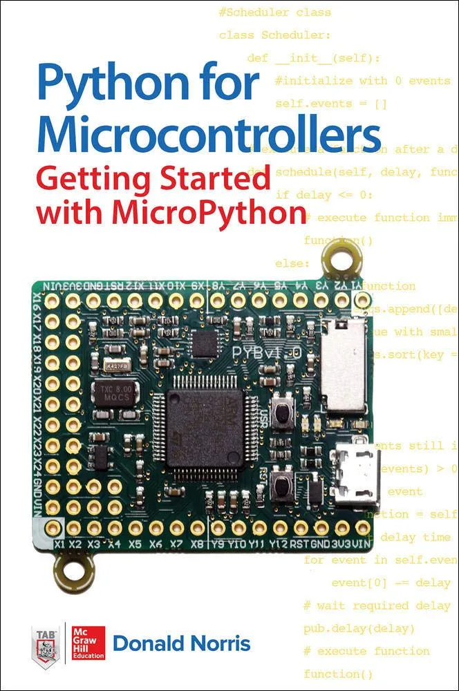

* [Beginning MicroPython with the Raspberry Pi Pico](https://www.amazon.com/Beginning-MicroPython-Raspberry-Pico-Electronics/dp/1484281349)

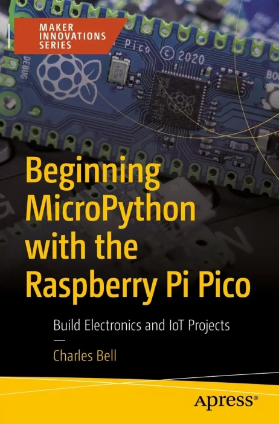

* [Programming the ESP32 in MicroPython](https://www.amazon.com/Programming-ESP32-MicroPython-Harry-Fairhead-ebook/dp/B0C8NV75TF)

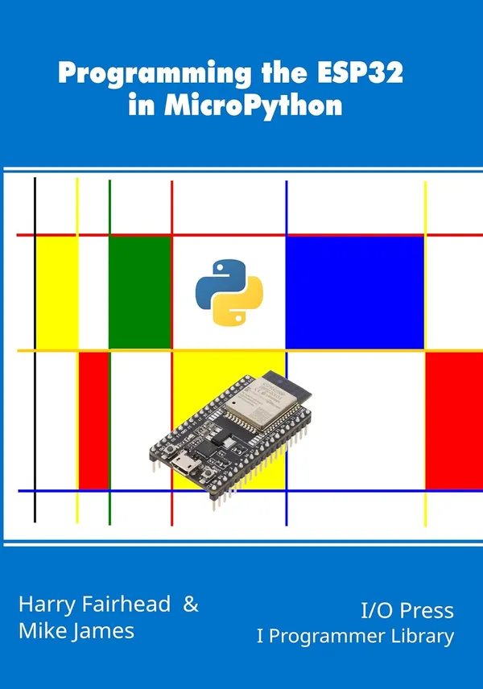

* [Get Started with MicroPython on Raspberry Pi Pico](https://www.amazon.com/Get-Started-MicroPython-Raspberry-Pico-ebook/dp/B0CZG2DKL4)

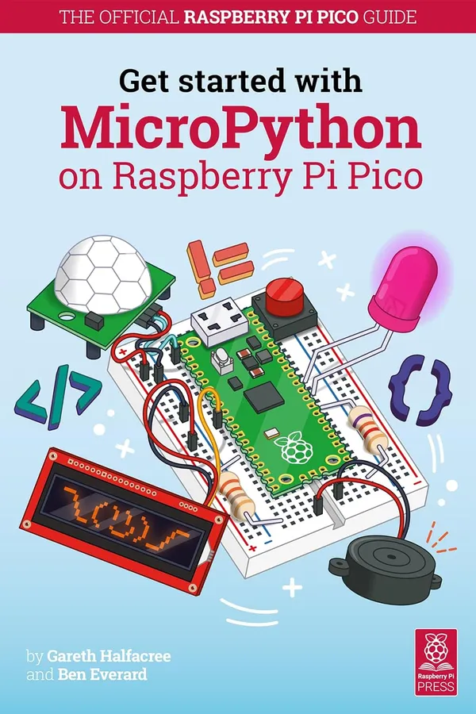

* [MicroPython Cookbook: Over 110 practical recipes for programming embedded systems and microcontrollers with Python](https://www.amazon.com/MicroPython-Cookbook-practical-programming-microcontrollers-ebook/dp/B07QXT664P)
* [code repository for MicroPython Cookbook](https://github.com/PacktPublishing/MicroPython-Cookbook)

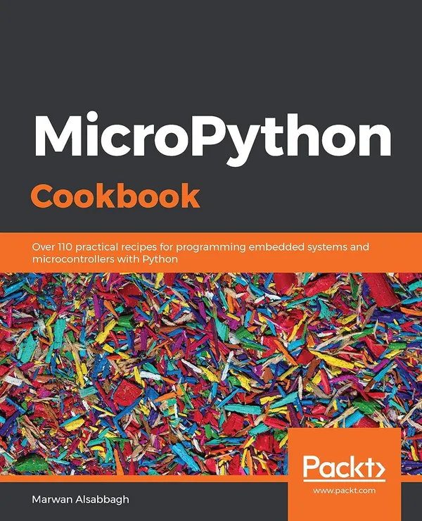

* [MicroPython Projects: A do-it-yourself guide for embedded developers to build a range of applications using Python](https://www.amazon.com/MicroPython-Projects-do-yourself-applications/dp/1789958032)

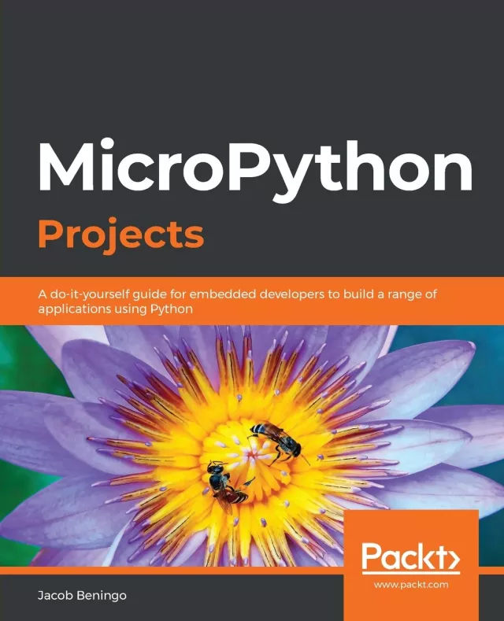

* [MicroPython for the Raspberry Pi Pico W: A gentle introduction to programming digital circuits with Python](https://www.amazon.com/MicroPython-Raspberry-Pico-introduction-programming/dp/B0BKSCV18D)

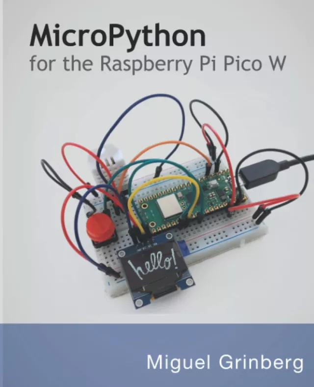

* [MicroPython for the Internet of Things: A Beginner’s Guide to Programming with Python on Microcontrollers](https://www.amazon.com/MicroPython-Internet-Things-Programming-Microcontrollers-ebook/dp/B0CRGM5QMQ)

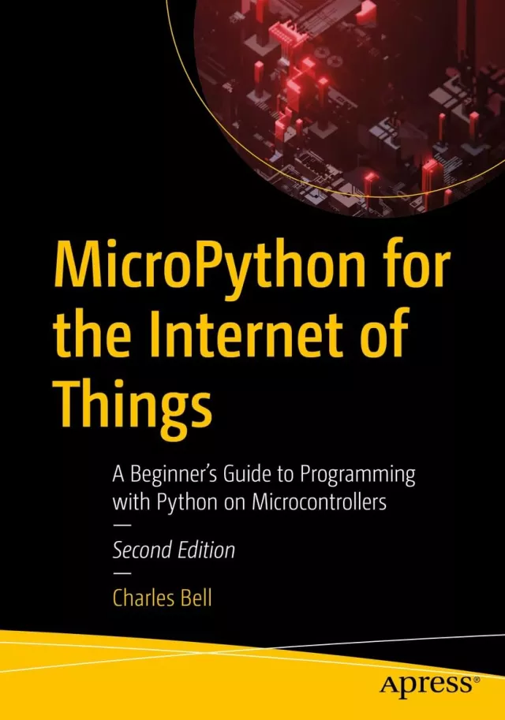

* [MicroPython Inline Assembler By Example](https://www.amazon.com/MicroPython-Inline-Assembler-Example-Magda-ebook/dp/B07ZQLSJHF)

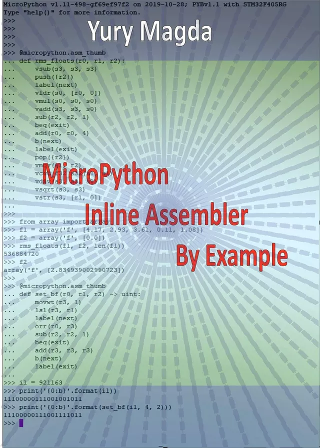

## 其它

* [Bridging the TinyML Language Gap with MicroPython and Emlearn](https://github.com/jonnor/embeddedml/tree/master/presentations/EmbeddedWorld2025)

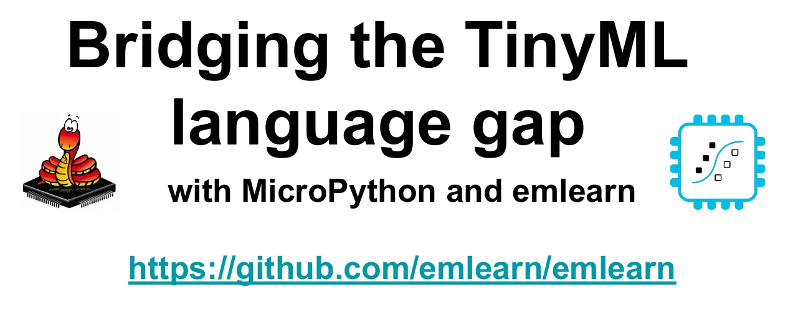

* [Sensor data processing on microcontrollers with MicroPython](https://github.com/jonnor/embeddedml/tree/master/presentations/euroscipy2025)

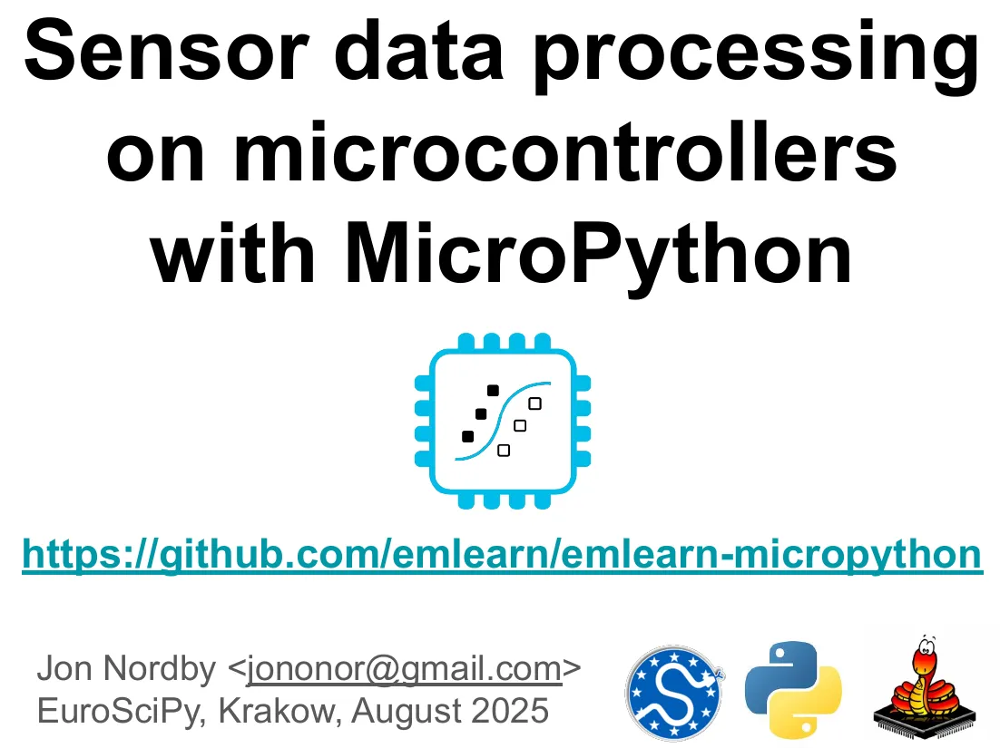
