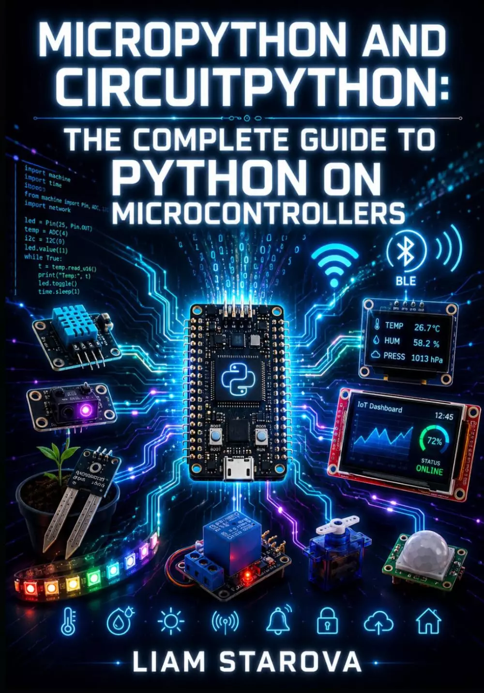

# MICROPYTHON和CIRCUITPYTHON：微控制器上python的完整指南：在RP2040、RP2350和ESP32硬件上构建物联网传感器、BLE设备、显示器和自动化项目 (MICROPYTHON AND CIRCUITPYTHON: THE COMPLETE GUIDE TO PYTHON ON MICROCONTROLLERS: Build IoT Sensors, BLE Devices, Displays, and Automated Projects on RP2040, RP2350, and ESP32 Hardware)

构建实用的MicroPython和CircuitPython项目，将真实的硬件、传感器、显示器、Wi-Fi、BLE、MQTT和自动化连接到工作的微控制器系统中。

微控制器上的Python功能强大，但许多初学者和自学成才的开发人员在示例与他们的电路板、固件、引脚、库、内存限制或无线功能不匹配时会陷入困境。本书帮助您超越简单的闪灯测试，更清楚地了解硬件、固件、代码和连接设备是如何协同工作的，从而构建项目。

MicroPython和CircuitPython：微控制器上的Python完整指南为您提供了一条实用的路径，通过使用RP2040、RP2350和ESP32硬件的电路板选择、固件设置、GPIO、传感器、显示器、网络、BLE、MQTT、可靠性、电源管理和集成自动化项目。

**在这里，你将学习如何：**

- 根据板级支持、库、工作流和项目目标在MicroPython和CircuitPython之间进行选择
- 在Pico、Pico W、Pico 2、Pico 2W和ESP32板上安装固件，并组织boot.py、main.py、code.py、lib、settings.toml和secrets.py等文件
- 使用GPIO电压、电流限制、上拉、下拉、低电平输出、按钮、LED、继电器、ADC、PWM和板特定引脚限制安全工作
- 使用I2C、SPI和UART进行传感器、显示器、GPS模块、串行设备和外围通信
- 读取环境、运动、距离、光线、土壤和存在传感器，然后通过平均、校准、验证和更安全的记录习惯来清理数据
- 使用SSD1306、ST7789、ILI9341、帧缓冲区、显示器、字体、位图、NeoPixels和状态反馈构建OLED和TFT显示仪表板
- 使用HTTP GET和POST请求、JSON解析、本地web服务器、重新连接逻辑、DNS故障排除和TLS限制创建Wi-Fi项目
- 使用MQTT代理、主题、有效负载、客户端ID、传感器发布、命令订阅、仪表板集成和重试行为
- 在支持的硬件上构建具有广告、服务、特征、UUID、GATT、aioble和adafruit_BLE的BLE项目
- 使用uasyncio和asyncio运行传感器、显示器、按钮、Wi-Fi、MQTT和状态反馈，而不会阻塞设备
- 管理内存、垃圾回收、JSON大小、显示RAM压力、监视器、异常处理、安全默认值和可恢复故障
- 使用驱动程序、配置文件、实用程序、硬件测试、日志、REPL诊断、I2C扫描和隔离测试构建项目
- 构建集成项目，包括智能工厂监视器、BLE温度信标、电话控制设备、网络控制继电器、运动自动化系统和最终的物联网仪表板

这是一本代码量很大的指南，其中包含可用的MicroPython和CircuitPython代码段，旨在帮助您构建真正的传感器节点、仪表板、BLE设备、web控件、MQTT自动化流程和长时间运行的嵌入式项目。

本书教你在使用可读的Python代码的同时，尊重内存、闪存磨损、电压限制、电路板差异、无线故障和安全硬件行为，而不是将微控制器视为微型台式计算机。

## 购买链接

- [亚马逊](https://www.amazon.com/-/zh/dp/B0H4B4VS17)

