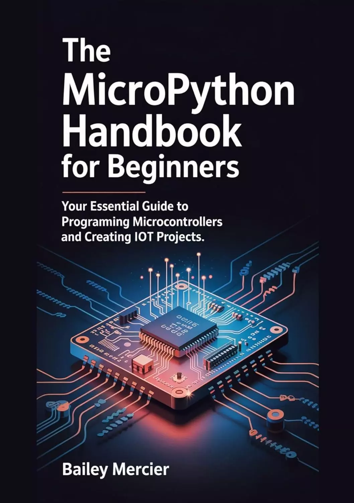

# MicroPython初学者手册：微控制器编程和创建物联网项目的基本指南 (The MicroPython Handbook for Beginners: Your Essential Guide to Programming Microcontrollers and Creating IoT Projects)

您准备好释放微控制器的潜力并将您的创新想法变为现实了吗？

这本书是你一直在等待的重要指南！它将实践知识与动手项目相结合，无缝地向您介绍MicroPython，这是一种专为微控制器设计的强大编程语言。
从使用简单的LED项目控制数字输出到构建与云连接的复杂物联网应用程序，本书涵盖了所有内容。您将了解如何从传感器读取数据、创建web服务器，甚至使用SD卡记录数据。有了清晰的解释和各种引人入胜的项目，你就有能力提高你的技能，把你的创意概念变成现实。

不要只写代码——创造、创新，并将你的想法转化为切实可行的解决方案。

立即获取您的副本，开始构建未来！

## 购买链接

- [亚马逊](https://www.amazon.com/-/zh/dp/B0F63D3RB7)
