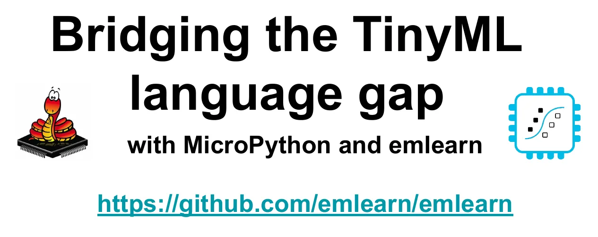

# Bridging the TinyML Language Gap with MicroPython and Emlearn（用MicroPython和Emlearn弥合TinyML语言鸿沟）

通过MicroPython和Emlearn现代机器学习弥合TinyML语言差距，可以从传感器数据中自动提取有价值的信息，并且可以将机器学习系统部署到低成本的嵌入式设备和传感器上。这个利基市场通常被称为“TinyML”，正在消费电子、科学和工业领域实现一系列新的应用。

emlearn是一个开源库，用于将机器学习模型部署到任何具有C99编译器的设备上。它提供了一个Python库，用于将标准模型（用scikit-learn和Keras制作）转换为高效的C代码。该库已被广泛应用于各种应用中，从声学传感器节点中的车辆检测到手势识别，再到Android设备中的实时恶意软件检测。

Zephyr RTOS是一个用于嵌入式设备的全面开源操作系统。它为各种微控制器提供硬件支持，包括低功耗操作和常见的无线通信协议。它还提供标准化的“传感器”API和广泛的内置驱动程序。这些功能的结合使该平台对TinyML应用程序非常有吸引力。

在本演示文稿中，我们将介绍emlearn项目，并展示如何将其与Zephyr一起使用。我们将介绍该库提供的关键功能和开发工具，并演示如何执行常见的机器学习任务——分类、回归和异常检测。

- [Bridging the TinyML Language Gap with MicroPython and Emlearn](https://github.com/jonnor/embeddedml/tree/master/presentations/EmbeddedWorld2025)
  - [pdf](https://github.com/jonnor/embeddedml/blob/master/presentations/EmbeddedWorld2025/Jon%20Nordby%20-%20Bridging%20the%20TinyML%20language%20gap%20with%20MicroPython%20and%20emlearn.pdf)
  - [pptx](https://github.com/jonnor/embeddedml/blob/master/presentations/EmbeddedWorld2025/Jon%20Nordby%20-%20Bridging%20the%20TinyML%20language%20gap%20with%20MicroPython%20and%20emlearn.pptx)
