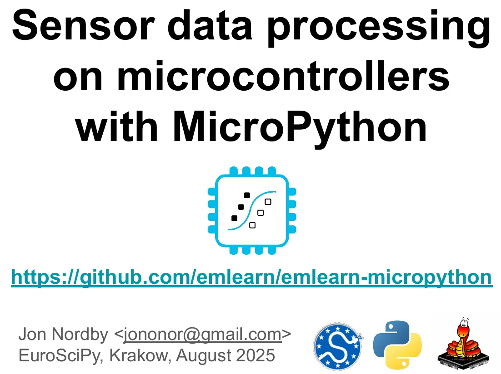

# Sensor data processing on microcontrollers with MicroPython（基于MicroPython的微控制器传感器数据处理）

能够感知物理现象对许多科学领域至关重要；从物理学中的粒子检测，到公共卫生中的污染测量，再到生态学中的生物多样性监测。在过去的几十年里，由于微处理器、MEMS传感器技术和低能耗无线通信的改进，传感器系统的性能和成本变得更好。因此，无线传感器网络和“物联网”（IoT）传感器系统正变得越来越普遍。

通常，传感器节点使用基于微控制器的硬件，固件主要使用C（或C++）开发。然而，现在使用Python编写微控制器固件变得可行。这要归功于MicroPython项目，以及过去几年中价格实惠且功能强大的硬件。使用熟悉的高级Python编程语言使工程师或科学家更容易访问创建传感器节点的过程。

在本次演讲中，我们将讨论使用MicroPython开发基于微控制器的传感器。这包括对MicroPython的简要介绍，如何进行高效的数据处理，并分享我们使用数字信号处理和机器学习技术处理加速度计和麦克风数据的经验。

- [Sensor data processing on microcontrollers with MicroPython](https://github.com/jonnor/embeddedml/tree/master/presentations/euroscipy2025)
  - [pdf](https://github.com/jonnor/embeddedml/blob/master/presentations/euroscipy2025/EuroSciPy%202025%20-%20Sensor%20data%20processing%20on%20microcontrollers%20with%20MicroPython.pdf)
  - [pptx](https://github.com/jonnor/embeddedml/blob/master/presentations/euroscipy2025/EuroSciPy%202025%20-%20Sensor%20data%20processing%20on%20microcontrollers%20with%20MicroPython.pptx)
