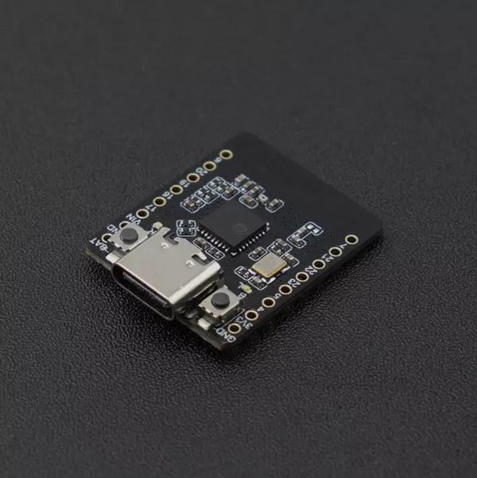
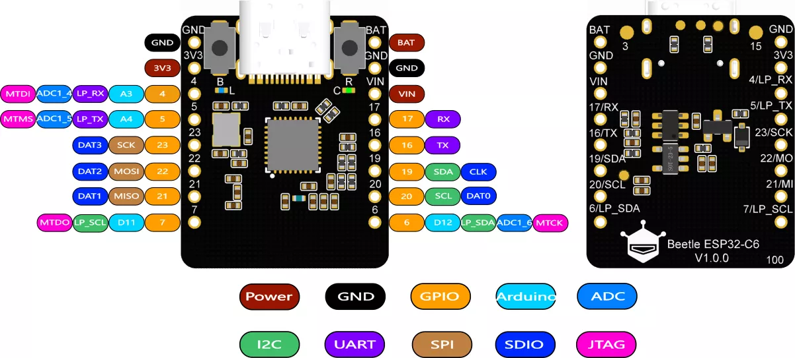

# Beetle ESP32 C6

Beetle ESP32-C6 是一款基于 ESP32-C6 芯片设计的迷你体积的 Arduino 低功耗物联网开发板（可以很好的支持 MicroPython），该开发板仅有硬币大小（25\*20.5mm）。ESP32-C6 搭载 160MHz 的高性能 RISC-V 32位处理器，支持 Wi-Fi 6、Bluetooth 5、Zigbee 3.0、Thread 1.3 通讯协议，可接入多种通讯协议的物联网网络。该开发板集成锂电池充电管理，无需外围模块即可对锂电池进行充电，可以使项目体积更加小巧。

* [开发板wiki](https://wiki.dfrobot.com.cn/SKU_DFR1117_Beetle_ESP32_C6)
  * [MicroPython教程](https://wiki.dfrobot.com.cn/SKU_DFR1117_Beetle_ESP32_C6#9.%20MicroPython教程)
* [原理图](https://img.dfrobot.com.cn/wiki/60c1e008bddfc41c3293de80/cd142fa4c52bad1b1a91346aa1c8f280.pdf)
* [尺寸图](https://img.dfrobot.com.cn/wiki/60c1e008bddfc41c3293de80/c63e95fbc631519bf9913bfc5e12aa0d.png)
* [MicroPython 固件下载](https://micropython.org/download/ESP32_GENERIC_C6/)
* [CircuitPython 固件下载](https://circuitpython.org/board/makergo_esp32c6_supermini/)
