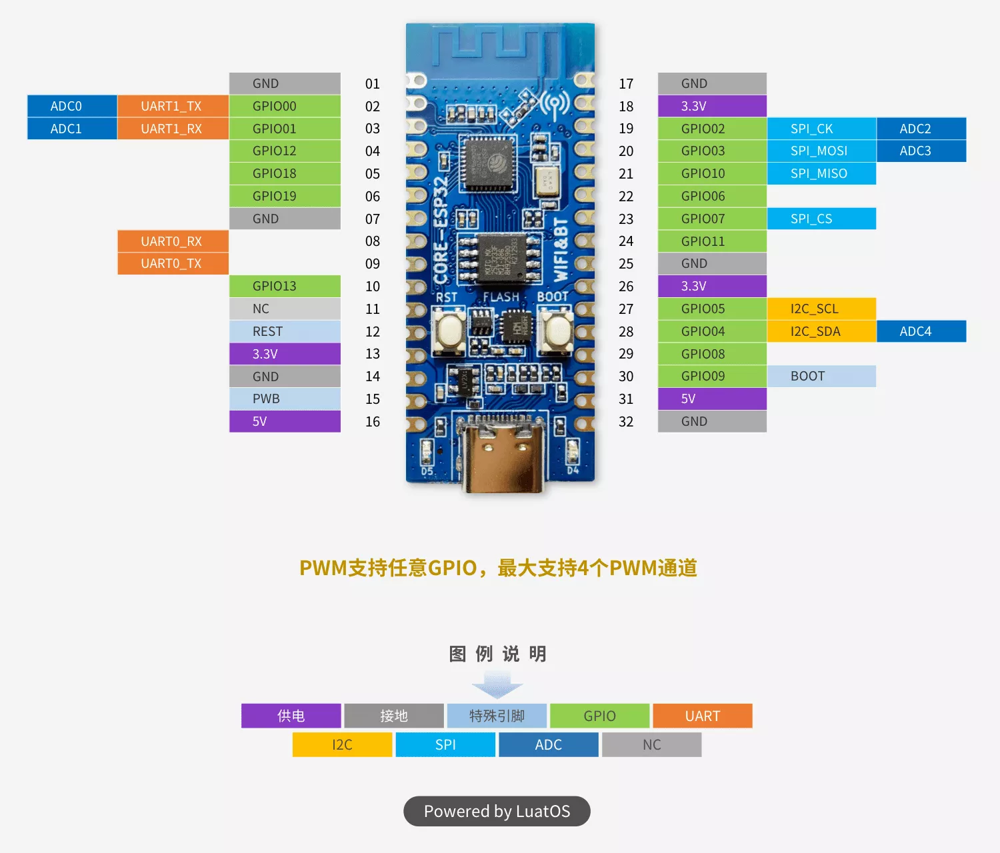

# CORE-ESP32C3

低成本的 CORE-ESP32C3 开发板，带有 4MB flash。

## 引脚图

## 相关链接

- [开发板 wiki](https://wiki.luatos.com/chips/esp32c3/board.html)
- [原理图](https://cdn.openluat-luatcommunity.openluat.com/attachment/20220609213416069_CORE-ESP32-A12.pdf)
- [micropython 固件](https://micropython.org/download/ESP32_GENERIC_C3)
- circuitpython 固件
  - [Luatos Core ESP32C3](https://circuitpython.org/board/luatos_core_esp32c3/)
  - [Luatos Core ESP32C3 – CH343](https://circuitpython.org/board/luatos_core_esp32c3_ch343/)
