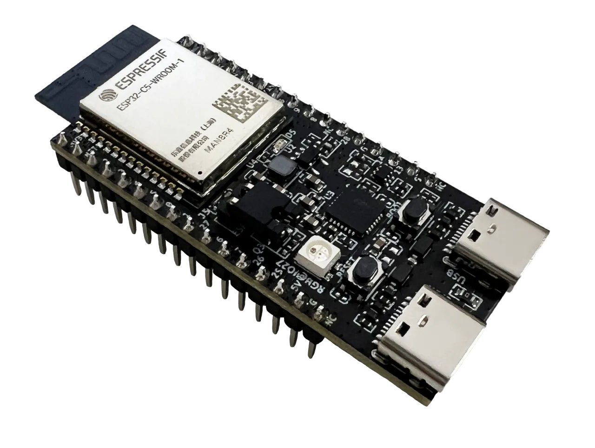
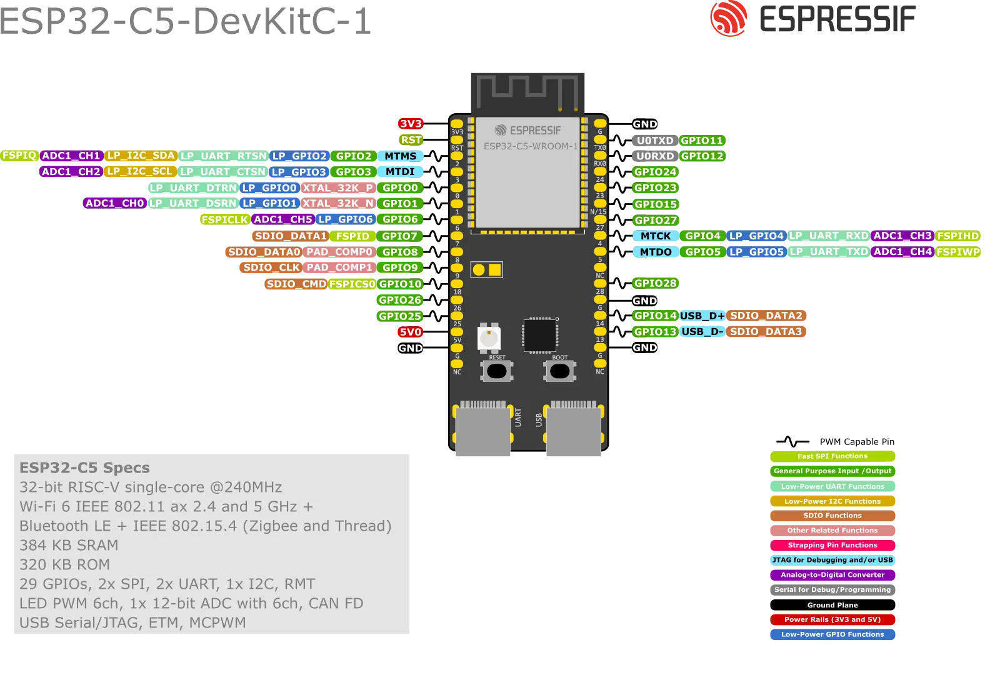

# ESP32-C5-DevKitC-1
ESP32-C5-DevKitC-1 是一款入门级开发板，使用通用型模组 ESP32-C5-WROOM-1(U)。该款开发板具备完整的 Wi-Fi、低功耗蓝牙、Zigbee 及 Thread 功能。

## 引脚图

## 相关链接

- [开发板资料](https://docs.espressif.com/projects/esp-dev-kits/zh_CN/latest/esp32c5/esp32-c5-devkitc-1/index.html)
  - [开发板说明](https://docs.espressif.com/projects/esp-dev-kits/zh_CN/latest/esp32c5/esp-dev-kits-zh_CN-master-esp32c5.pdf) (PDF)
  - [ESP32-C5 技术规格书](https://www.espressif.com/sites/default/files/documentation/esp32-c5_datasheet_cn.pdf) (PDF)
  - [ESP32-C5-WROOM-1 & ESP32-C5-WROOM-1U 技术规格书](https://www.espressif.com/sites/default/files/documentation/esp32-c5-wroom-1_wroom-1u_datasheet_cn.pdf) (PDF)
  - [ESP32-C5-DevKitC-1 原理图 v1.2](https://dl.espressif.com/dl/schematics/SCH_ESP32-C5-DevkitC-1_V1.2_20250211.pdf) (PDF)
  - [ESP32-C5-DevKitC-1 PCB 布局图 v1.2](https://dl.espressif.com/dl/schematics/PCB_ESP32-C5-DevKitC-1_V1.2_20250211.pdf) (PDF)
  - [ESP32-C5-DevKitC-1 尺寸图 v1.2](https://dl.espressif.com/dl/schematics/Dimension_esp32-c5-devkitc-1_v1.2_20250509.pdf) (PDF)
- [micropython 固件](https://micropython.org/download/ESP32_GENERIC_C5/)
- circuitpython 固件
