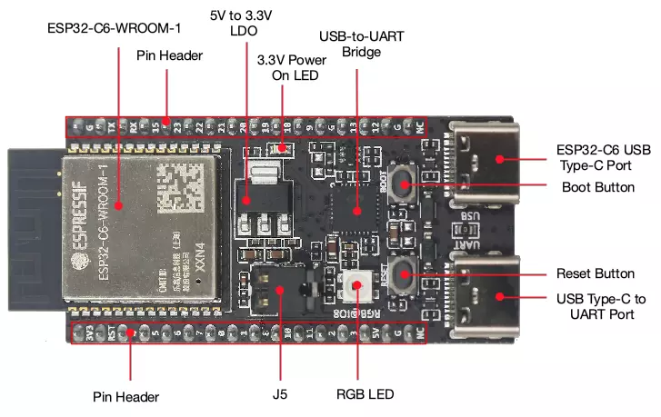
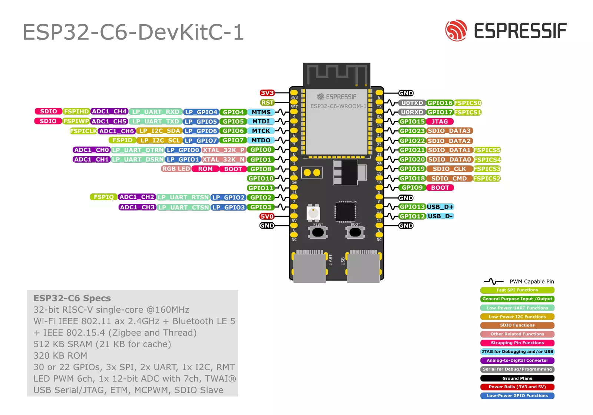

# ESP32-C6-DevKitC-1

ESP32-C6-DevKitC-1 是一款入门级开发板，使用带有 8 MB SPI flash 的通用型模组 ESP32-C6-WROOM-1(U)。该款开发板具备完整的 Wi-Fi、低功耗蓝牙、Zigbee 及 Thread 功能。

板上模组大部分管脚均已引出至两侧排针，开发人员可根据实际需求，轻松通过跳线连接多种外围设备，同时也可将开发板插在面包板上使用。

## 引脚图

https://docs.espressif.com/projects/espressif-esp-dev-kits/zh_CN/latest/esp32c6/esp32-c6-devkitc-1/user_guide.html
