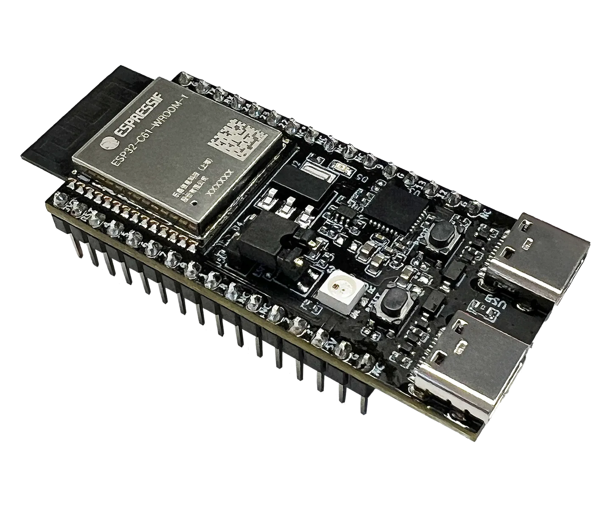

# ESP32-C61-DevKitC-1

ESP32-C61-DevKitC-1 是一款入门级开发板，使用通用型模组 ESP32-C61-WROOM-1。该开发板搭载的模组配置了高达 8 MB SPI flash 和 2 MB PSRAM。该款开发板具备完整的 Wi-Fi 和低功耗蓝牙功能。

## 引脚图

## 相关链接

- [开发板资料](https://docs.espressif.com/projects/esp-dev-kits/zh_CN/latest/esp32c61/esp32-c61-devkitc-1/user_guide.html)
	- [ESP32-C61 技术规格书](https://www.espressif.com/sites/default/files/documentation/esp32-c61_datasheet_cn.pdf) (PDF)
	- [ESP32-C61-WROOM-1 技术规格书](https://www.espressif.com/sites/default/files/documentation/esp32-c61-wroom-1_wroom-1u_datasheet_cn.pdf) (PDF)
	- [ESP32-C61-DevKitC-1 原理图](https://dl.espressif.com/dl/schematics/esp32-c61-devkitc-1-schematics_v2.0.pdf) (PDF)
	- [ESP32-C61-DevKitC-1 PCB 布局图](https://dl.espressif.com/dl/schematics/esp32-c61-devkitc-1-pcb-layout_v2.0.pdf) (PDF)
	- [ESP32-C61-DevKitC-1 尺寸图](https://dl.espressif.com/dl/schematics/esp32-c61-devkitc-1-dimensions_v2.0.pdf) (PDF)
	- [ESP32-C61-DevKitC-1 尺寸图源文件](https://dl.espressif.com/dl/schematics/ESP32-C61-DevKitC-1-dimensions_v2.0.dxf) (DXF)
- micropython 固件
- [circuitpython 固件](https://circuitpython.org/board/espressif_esp32c61_devkitc_1_n8r2/)
