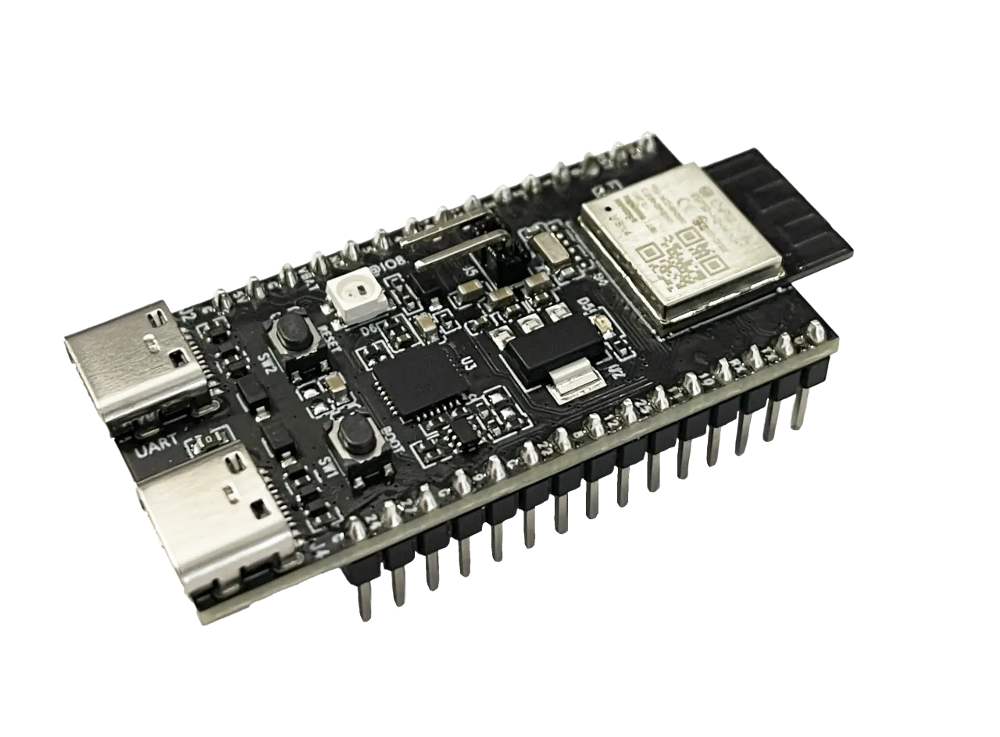
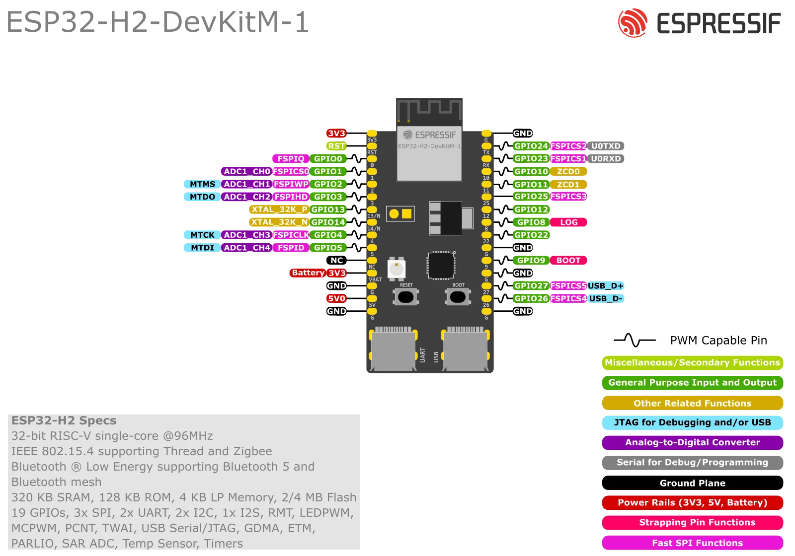

# ESP32-H2-DevKitM-1

ESP32-H2-DevKitM-1 是一款入门级开发板，搭载低功耗蓝牙®和 IEEE 802.15.4 双模模组 ESP32-H2-MINI-1 或 ESP32-H2-MINI-1U。

板上模组的大部分管脚均已引出至开发板两侧排针，开发人员可根据实际需求，轻松通过跳线连接多种外围设备，同时也可将开发板插在面包板上使用。

## 引脚图

## 相关链接

- [开发板文档](https://docs.espressif.com/projects/esp-dev-kits/zh_CN/latest/esp32h2/esp32-h2-devkitm-1/user_guide.html)
  - [开发板说明](https://docs.espressif.com/projects/esp-dev-kits/zh_CN/latest/esp32h2/esp-dev-kits-zh_CN-master-esp32h2.pdf) (PDF)
  - [ESP32-H2 技术规格书](https://www.espressif.com/sites/default/files/documentation/esp32-h2_datasheet_cn.pdf) (PDF)
  - [ESP32-H2-MINI-1/1U 技术规格书](https://www.espressif.com/sites/default/files/documentation/esp32-h2-mini-1_mini-1u_datasheet_cn.pdf) (PDF)
  - [ESP32-H2-DevKitM-1 原理图 v1.3](https://dl.espressif.com/dl/schematics/esp32-h2-devkitm-1_v1.3_schematics.pdf) (PDF) - 适用于 PW-2024-02-0362 及之后的开发板
  - [ESP32-H2-DevKitM-1 原理图 v1.2](https://dl.espressif.com/dl/schematics/esp32-h2-devkitm-1_v1.2_schematics.pdf) (PDF) - 适用于 PW-2024-02-0362 之前的开发板
  - [ESP32-H2-DevKitM-1 PCB 布局图](https://dl.espressif.com/dl/schematics/esp32-h2-devkitm-1_v1.2_pcb_layout.pdf) (PDF)
  - [ESP32-H2-DevKitM-1 尺寸图](https://dl.espressif.com/dl/schematics/esp32-h2-devkitm-1_v1.2_dimension.pdf) (PDF)
- micropython 固件
- [circuitpython 固件](https://circuitpython.org/board/espressif_esp32h2_devkitm_1_n4/)
