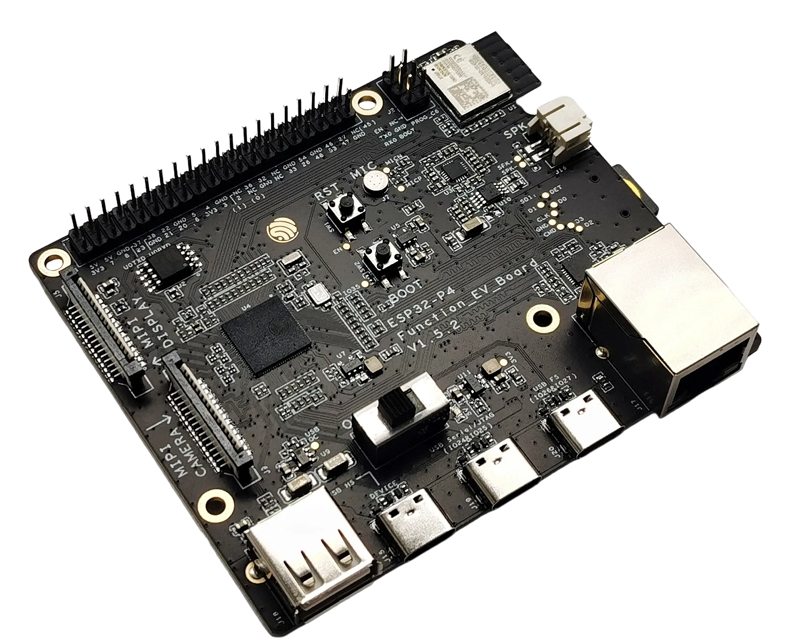

# ESP32-P4-Function-EV-Board

ESP32-P4-Function-EV-Board 是一款基于 ESP32-P4 芯片的多媒体开发板。ESP32-P4 搭载双核 RISC-V 处理器，支持最大 32 MB PSRAM。此外，ESP32-P4 支持 USB 2.0 标准, MIPI-CSI/DSI, H264 Encoder 等多种外设，可满足客户对低成本、高性能、低功耗的多媒体产品的开发需求。

此开发板搭载了 ESP32-C6-MINI-1 2.4 GHz Wi-Fi 6 & Bluetooth 5 (LE) 模组，用于该开发板的 Wi-Fi 和蓝牙通信；它还配置了一块 7 英寸电容式触摸屏，分辨率为 1024 x 600，并配有一颗 200 万像素的 MIPI CSI 接口摄像头，丰富了用户的交互体验。该开发板适用于可视门铃、网络摄像头、智能家居中控屏、LCD 电子价签、两轮车仪表盘等产品的原型构建。

**链接**

- [开发板网址](https://docs.espressif.com/projects/esp-dev-kits/zh_CN/latest/esp32p4/esp32-p4-function-ev-board/user_guide.html)
- MicroPython 固件下载
- [CircuitPython固件下载](https://circuitpython.org/board/espressif_esp32p4_function_ev/)
