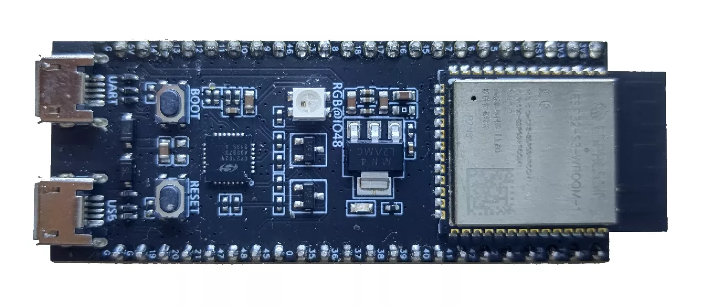
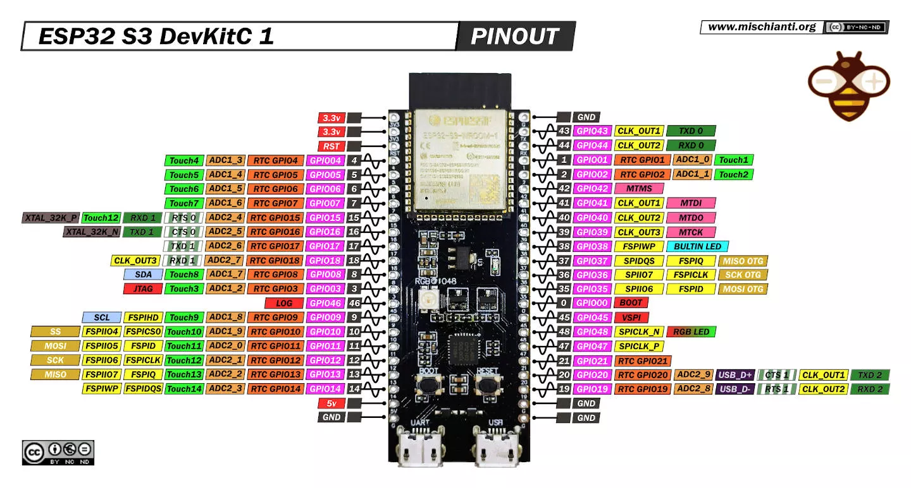

# ESP32-S3-DevKitC-1

乐鑫官方的 ESP32-S3-DevKitC-1 开发板，带有 2 个 USB 接口（一个原生 USB 接口和一个 USB 转串口），两个 USB 接口都可以下载程序。它有几种不同型号，主要区别在于模块内部的 flash 和 psram 的大小不同。

## 相关链接

- [开发板网站](https://docs.espressif.com/projects/esp-dev-kits/zh_CN/latest/esp32s3/esp32-s3-devkitc-1/index.html)
- [micropython 固件](https://micropython.org/download/ESP32_GENERIC_S3)
- circuitpython 固件
    - [ESP32-S3-DevKitC-1-N8](https://circuitpython.org/board/espressif_esp32s3_devkitc_1_n8/)
    - [ESP32-S3-DevKitC-1-N16](https://circuitpython.org/board/espressif_esp32s3_devkitc_1_n16/)
    - [ESP32-S3-DevKitM-1-N8](https://circuitpython.org/board/espressif_esp32s3_devkitm_1_n8/)
    - [ESP32-S3-DevKitC-1-N8R2](https://circuitpython.org/board/espressif_esp32s3_devkitc_1_n8r2/)
    - [ESP32-S3-DevKitC-1-N8R8](https://circuitpython.org/board/espressif_esp32s3_devkitc_1_n8r8/)
    - [ESP32-S3-DevKitC-1-N32R8](https://circuitpython.org/board/espressif_esp32s3_devkitc_1_n32r8/)
