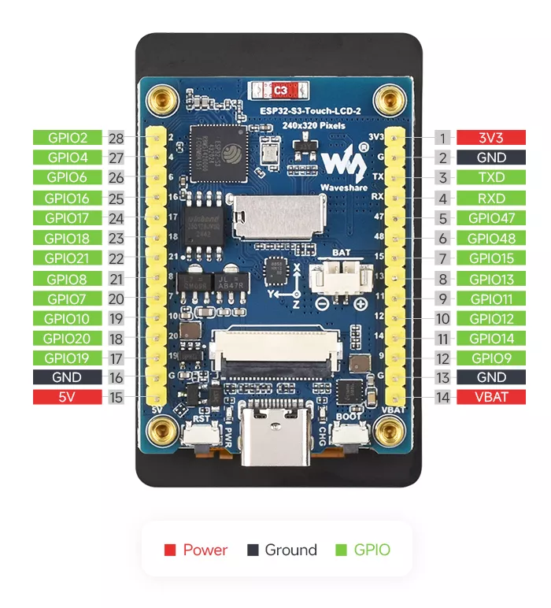
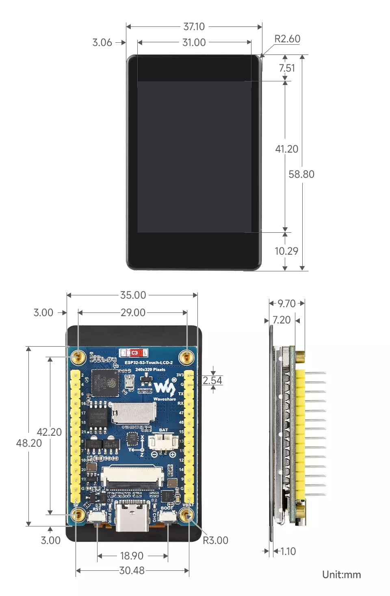

# 微雪 ESP32-S3-Touch-LCD-2
微雪 (Waveshare) 设计的低成本，高性能的微控制器开发板。在较小的尺寸下，板载了 2 英寸电容触摸 LCD 屏、锂电池充电芯片、六轴传感器 (三轴加速度计与三轴陀螺仪)、摄像头接口等外设，方便开发并嵌入应用到产品中。 

## 产品特性

- 搭载 ESP32-S3R8 高性能 Xtensa 32 位 LX7 双核处理器，主频高达 240 MHz
- 支持 2.4 GHz Wi-Fi (802.11 b/g/n) 和 Bluetooth 5 (LE)，板载天线
- 内置 512KB 的 SRAM 和 384KB ROM，叠封 8MB PSRAM 和外接 16MB Flash
- 采用 Type-C 接口，紧跟时代潮流，无需纠结正反插
- 板载 2 英寸电容触摸 LCD 屏，240 × 320 分辨率，262K 彩色，能清晰地显示彩色图片
- 内置 ST7789T3 驱动芯片和 CST816D 电容触控芯片，可分别使用 SPI 和 I2C 接口通信，不占用过多接口引脚资源
- 板载 QMI8658 六轴惯性测量单元 (3 轴加速度、3 轴陀螺仪)
- 板载 3.7V MX1.25 锂电池充放电接口
- 板载 USB Type-C 接口，可用于供电和下载调试，方便开发使用
- 板载 Micro SD 卡槽，可外接 SD 卡存储图片或文件
- 引出 22 个 GPIO，可灵活配置外设功能
- 板载摄像头接口，兼容 OV2640 和 OV5640 等主流摄像头，适用于图像和视频采集

## 引脚图

## 尺寸图

## 相关链接

- [产品 wiki](https://www.waveshare.net/wiki/ESP32-S3-Touch-LCD-2)
- [micropython 固件](https://github.com/MicroPythonOS/MicroPythonOS/releases)
- [circuitpython 固件](https://circuitpython.org/board/waveshare_esp32_s3_touch_lcd_2/)
- [ESP32-S3-Touch-LCD-2 原理图](https://www.waveshare.net/w/upload/6/65/ESP32-S3-Touch-LCD-2-SchDoc.pdf)
- [ESP32-S3-Touch-LCD-2 2D/3D文件](https://www.waveshare.net/w/upload/4/42/ESP32-S3-Touch-LCD-2_-20241108.rar)
- [ESP32-S3-Touch-LCD-2-C 2D/3D文件](https://www.waveshare.net/w/upload/e/e7/ESP32-S3-Touch-LCD-2-C.rar)
- [ESP32-S3技术参考手册（中文）](https://www.waveshare.net/w/upload/8/88/Esp32-s3_technical_reference_manual_cn.pdf)
- [ESP32-S3系列芯片技术规格书（中文）](https://www.waveshare.net/w/upload/5/58/Esp32-s3_datasheet_cn.pdf)
- [LVGL官方文档](https://docs.lvgl.io/master/intro/introduction/index.html)
