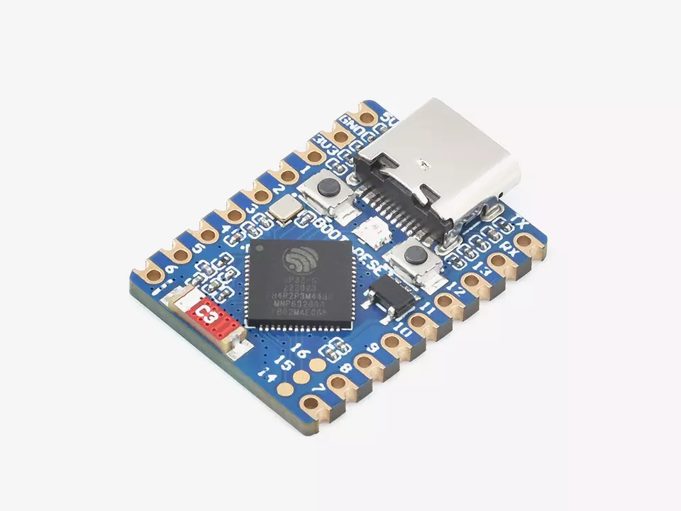
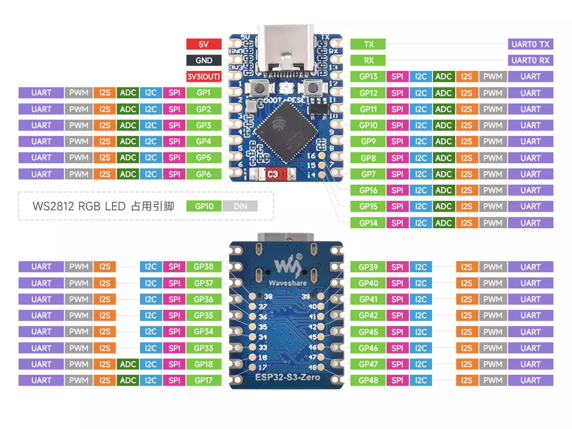
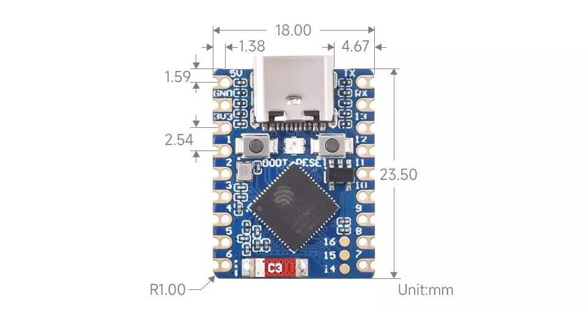

# ESP32-S3-Zero

## 产品简介

ESP32-S3-Zero(贴片板), ESP32-S3-Zero-M(排针版) 体积小巧，采用半孔工艺，便于集成到其它主板上，ESP32-S3-Zero 板载 Type-C USB，在小板型下引出大部分未占用引脚，采用的 ESP32-FH4R2 是集成了低功耗 Wi-Fi 和 BLE5.0 的系统级芯片(SoC)，具有 4MB Flash 和 2MB PSRAM。另外，具有硬件加密加速器、RNG、HMAC 和数字签名 (Digital Signature) 模块，满足物联网的安全要求和丰富的外设接口。多种低功耗工作状态满足在物联网 (IoT)、移动设备、可穿戴电子设备、智能家居等应用场景的功耗需求。

## 产品特性

- 搭载高性能 Xtensa® 32 位 LX7 双核处理器，主频高达 240MHz
- 支持 2.4GHz Wi-Fi (802.11 b/g/n) 和 Bluetooth® 5 (LE)
- 内置 512KB SRAM 和 384KB ROM，叠封 4MB Flash 和 2MB PSRAM
- 采用邮票孔设计，板载陶瓷天线，方便集成到用户自主设计的底板上
- 支持灵活时钟，模块电源单独设置等控制，实现多场景低功耗模式
- 集成 USB 串口全速控制器，引出 34 个 GPIO 可灵活配置外设功能
- 具有 4 × SPI，2 × I2C，3 × UART，2 × I2S，2 × ADC 等外设

https://www.waveshare.net/wiki/ESP32-S3-Zero
