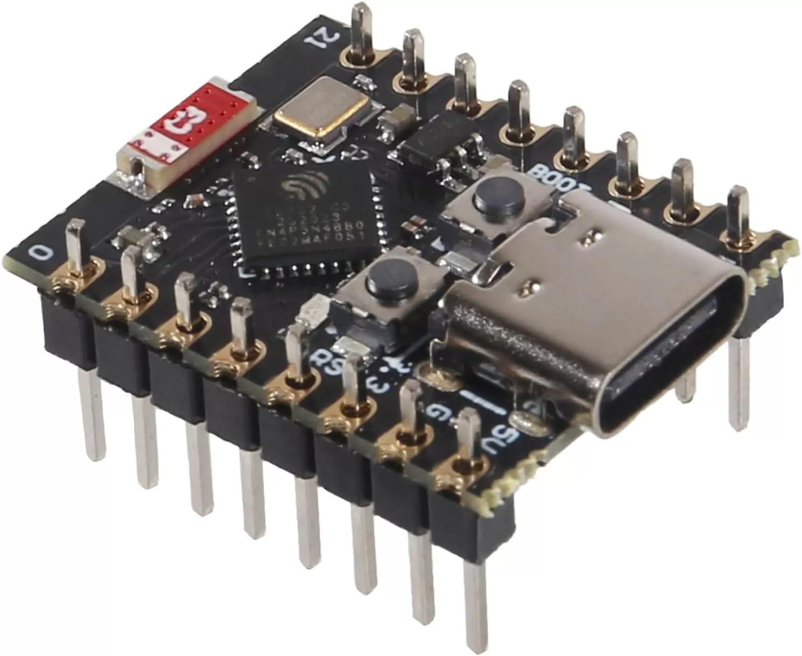
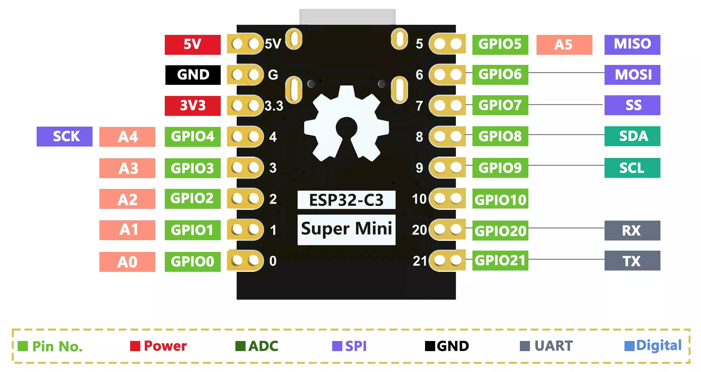
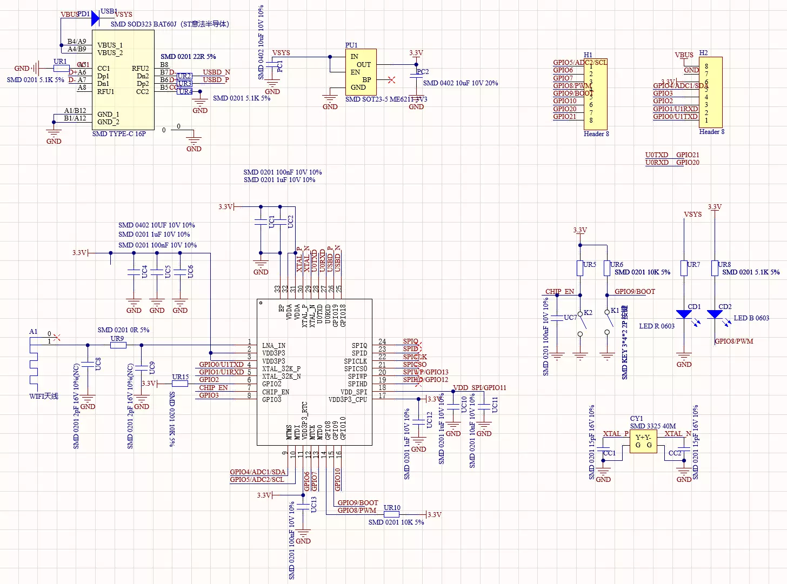

# ESP32C3 SuperMini

迷你 ESP32C3 开发板，拇指大小（22.52x18mm）。

## 引脚图

## 原理图

## 相关链接
- [开发板说明](https://www.nologo.tech/product/esp32/esp32c3/esp32c3supermini/esp32C3SuperMini.html)
- [micropython 固件](https://micropython.org/download/ESP32_GENERIC_C3/)
- [circuitpython 固件](https://circuitpython.org/board/makergo_esp32c3_supermini/)
