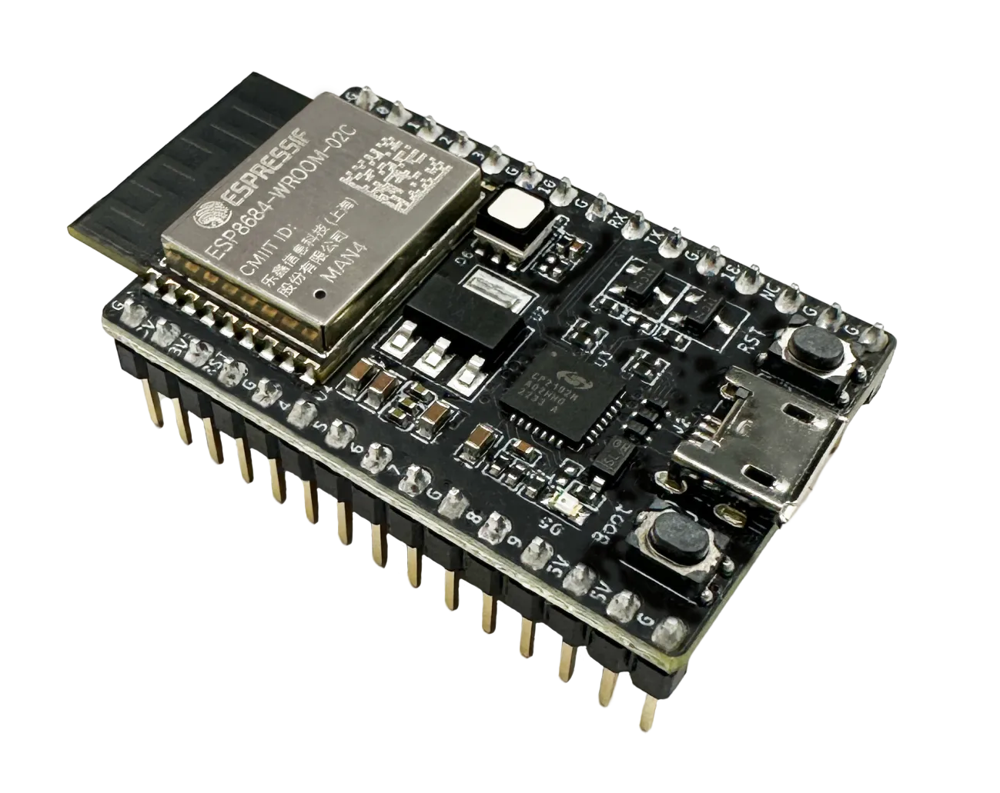
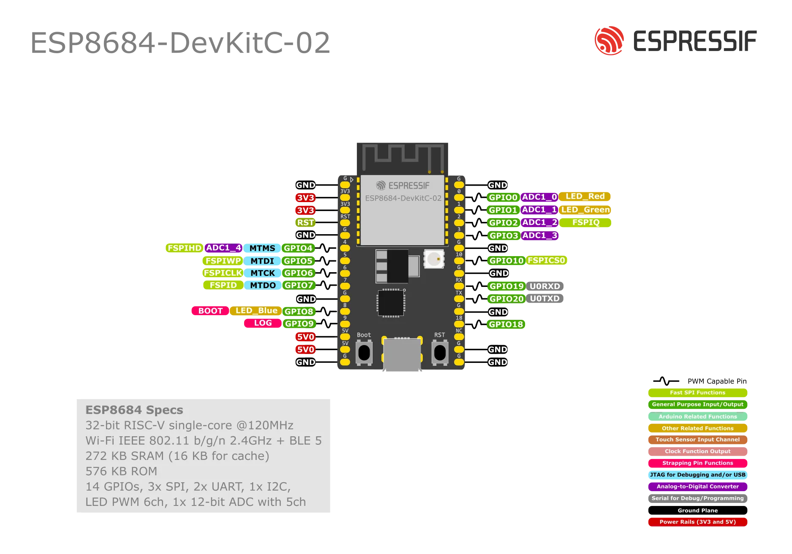

# ESP8684-DevKitC-2-N4

esp32-c2 开发板

**引脚图**

**相关链接**

- [MicroPython 固件下载](https://micropython.org/download/ESP32_GENERIC_C2/)
- [CircuitPython 固件下载](https://circuitpython.org/board/espressif_esp8684_devkitc_02_n4/)

---

- [开发板网站](https://docs.espressif.com/projects/esp-dev-kits/zh_CN/latest/esp32c2/esp8684-devkitc-02/user_guide.html)
- [ESP8684 技术规格书](https://www.espressif.com/sites/default/files/documentation/esp8684_datasheet_cn.pdf) (PDF)
- [ESP8684-DevKitC-02 原理图](https://dl.espressif.com/dl/schematics/esp8684-devkitc-02-schematics_V1.0.pdf) (PDF)
- [ESP8684-DevKitC-02 PCB 布局图](https://dl.espressif.com/dl/schematics/esp8684-devkitc-02-pcb-layout_V1.0.pdf) (PDF)
- [ESP8684-DevKitC-02 尺寸图](https://dl.espressif.com/dl/schematics/esp8684-devkitc-02-dimensions_V1.0.pdf) (PDF)
- [ESP8684-DevKitC-02 尺寸图源文件](https://dl.espressif.com/dl/schematics/esp8684-devkitc-02-dimensions_source_V1.0.dxf) (DXF)
