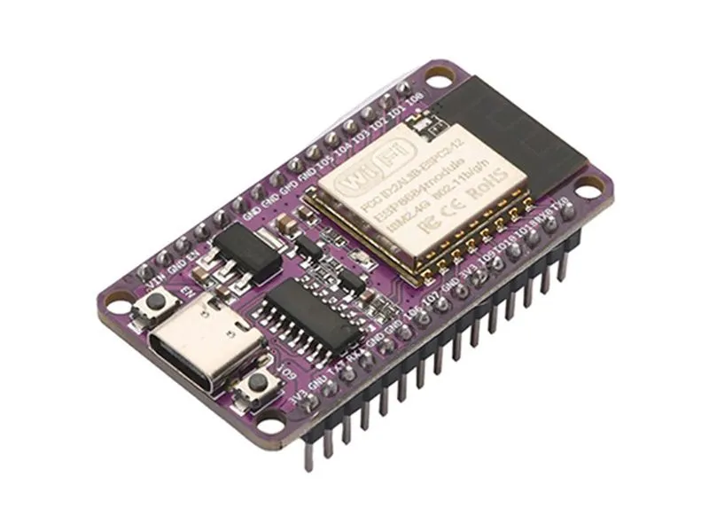
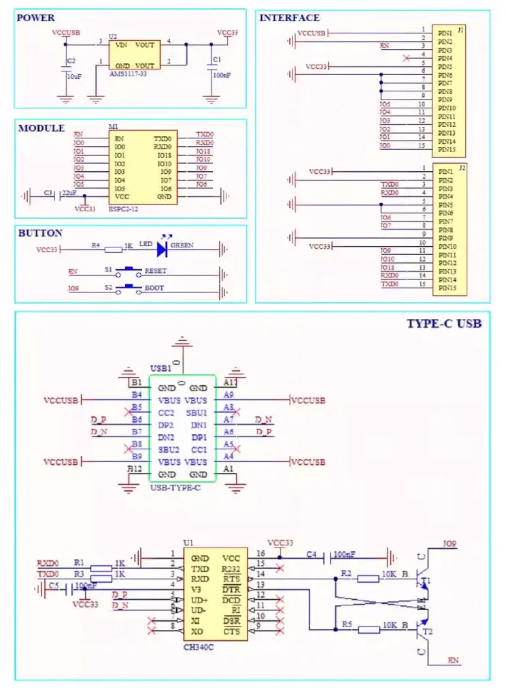
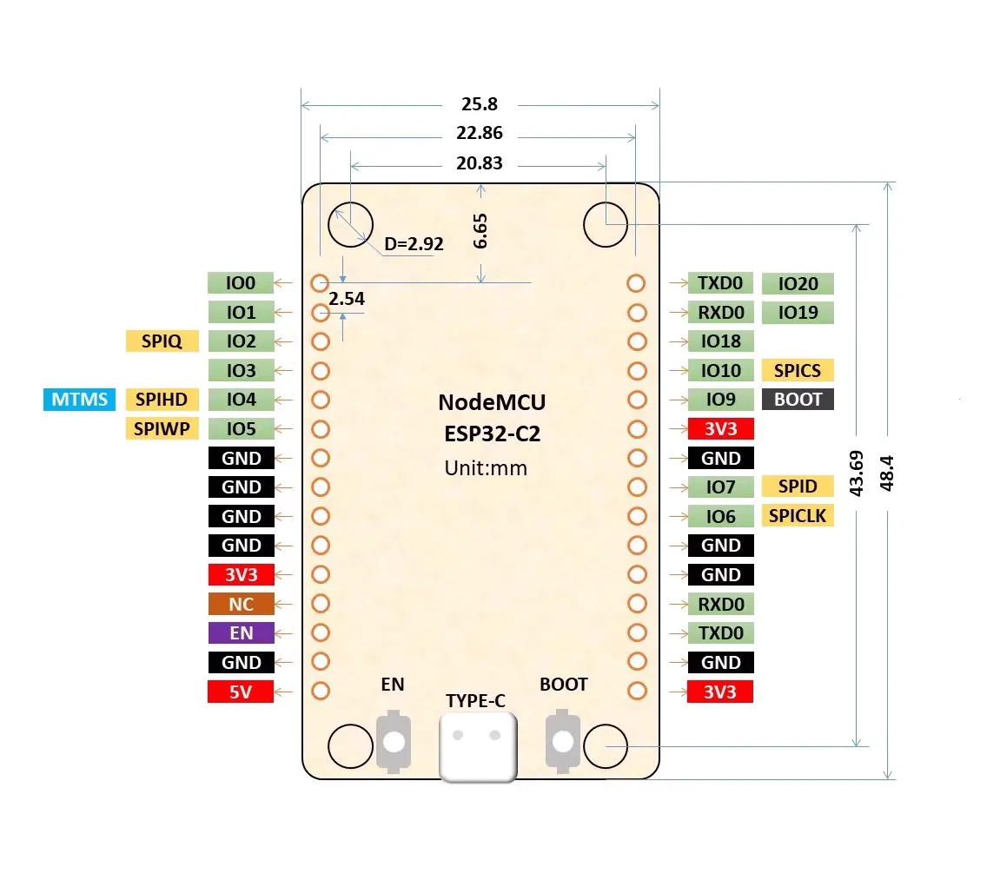

# NODEMCU ESP32-C2 开发板

NODEMCU ESP32-C2 开发板，使用 ESPC2-12（ESP8684）模块取代了ESP8266，兼顾了低成本和高性能。

**原理图**

**引脚图**

**固件下载**

- [micropython](https://micropython.org/download/ESP32_GENERIC_C2/)
- [circuitpython](https://circuitpython.org/board/nodemcu_esp32c2/)
