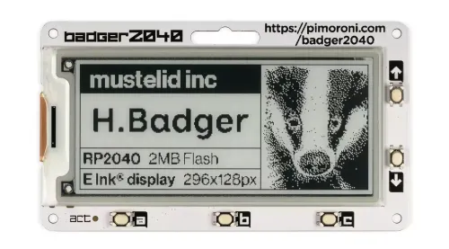
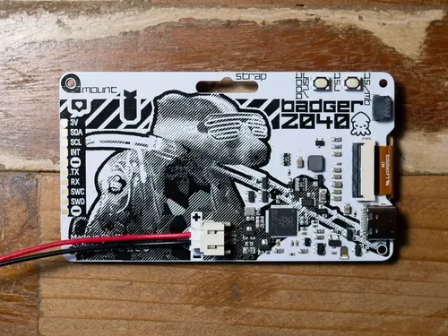
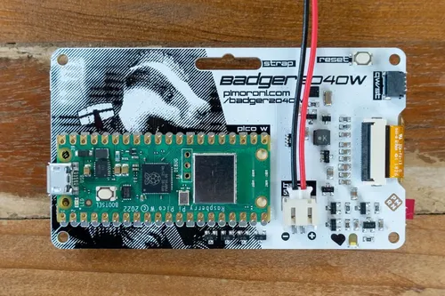

# Pimoroni Badger 2040 开发板

为了纪念 Raspberry Pi 的 10 周末，Pimoroni 将 RP2040 与 EPD 融合在一起，设计了一个独特的开发板。

可以用于：
- 按下按钮时在图像、说明或身份牌之间切换
- 移动气象站或空气质量监视器（通过添加传感器）
- 存储重要的QR代码，以进入位置
- 列出一个小的待办事项清单
- 展示名人名言

## 特征
- 2.9 英寸黑白 E Ink® 显示屏（296 x 128 像素）
	- 超宽视角
	- 超低功耗
	- 点距 - 0.227 x 0.226 毫米
- 由 RP2040 供电（双 Arm Cortex M0+，运行速度高达 133Mhz，具有 264kB SRAM）
- 支持 XiP 的 2MB QSPI 闪存
- 五个前用户按钮
- 重置和Boot按钮（Boot按钮也可以用作用户按钮）
- 白光LED
- 用于供电和编程的 USB-C 连接器
- 用于连接电池的 JST-PH 连接器（输入范围 2.7V - 6V）
- 用于电池电量监测的高精度电压基准
- Qw/ST (Qwiic/STEMMA QT) 连接器
- 完全组装（无需焊接）
- [原理图](https://cdn.shopify.com/s/files/1/0174/1800/files/badger_2040_schematic.pdf?v=1645702148)
- [机械图](https://cdn.shopify.com/s/files/1/0174/1800/files/badgerdiagram.png?v=1647960358)
- C++/MicroPython 库
  - [UC8151/IL0373 电子纸显示驱动](../../../MicroPython库/第三方库/uc8151/readme.md)

---

- [商品链接](https://shop.pimoroni.com/products/badger-2040)
- [使用指南](https://learn.pimoroni.com/article/getting-started-with-badger-2040)

Badger 2040 有两个版本：Badger 2040 和 Badger 2040 W。

