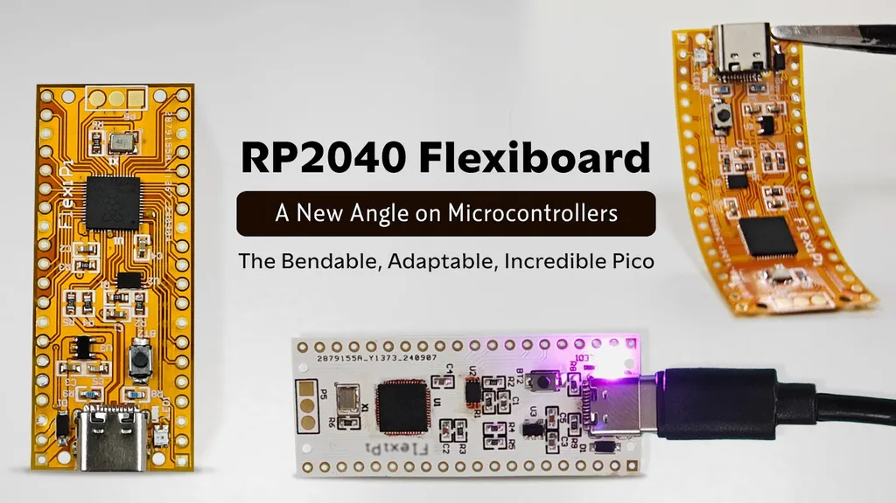

# RP2040 FlexiBoard

首个支持 360 度弯曲的全柔性 RP2040 Pico，性能与灵活性的完美结合，使用 Type C 接口。RP2040 FlexiBoard  围绕树莓派旗舰芯片 RP2040 构建， 为开发者、制造商和爱好者提供了无与伦比的多功能性。

RP2040 FlexiBoard 在 Kickstarter 众筹的说明：
- https://www.kickstarter.com/projects/harshu/rp2040-flexiboard
