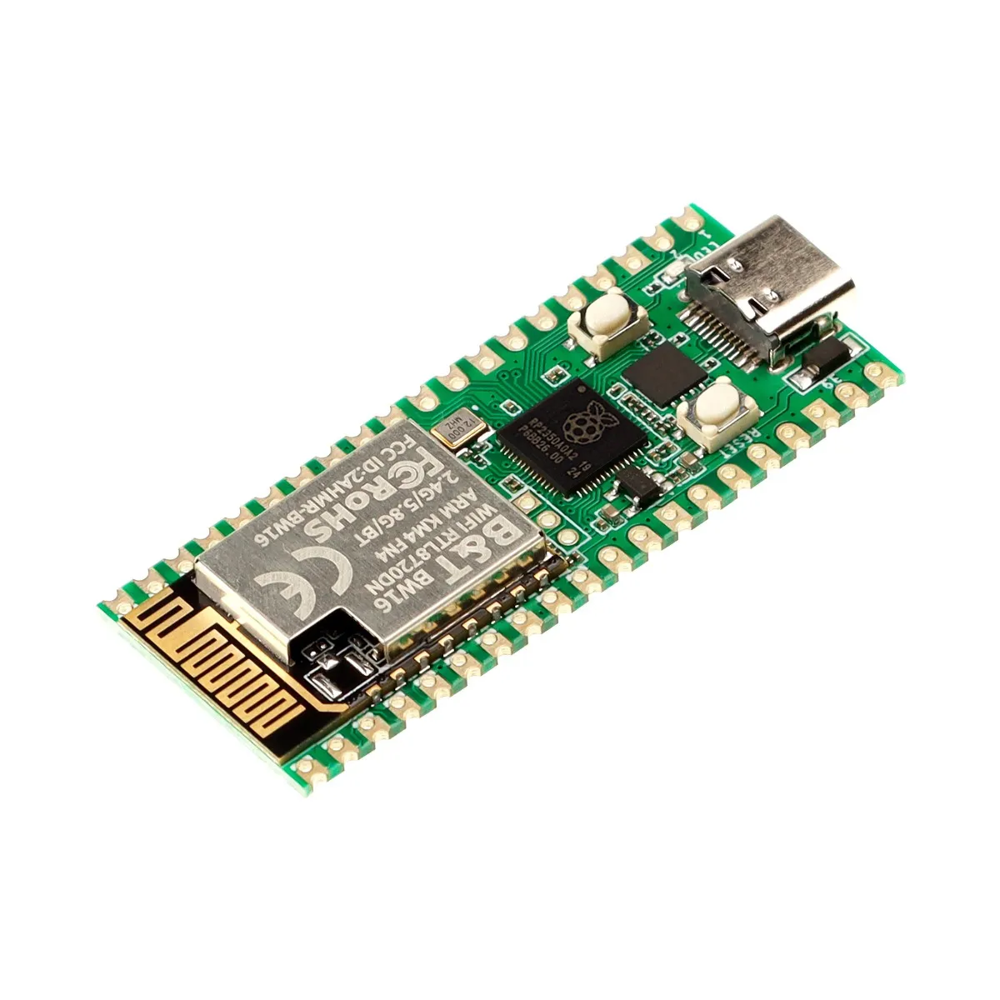
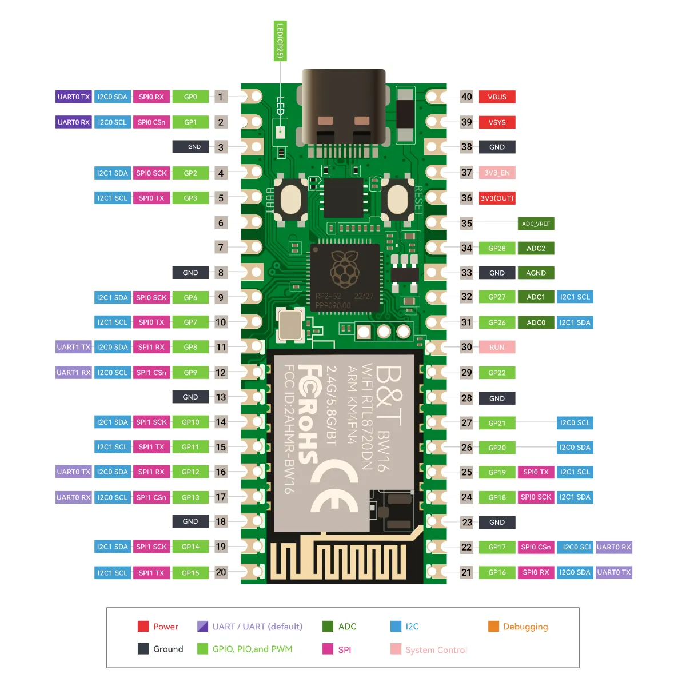
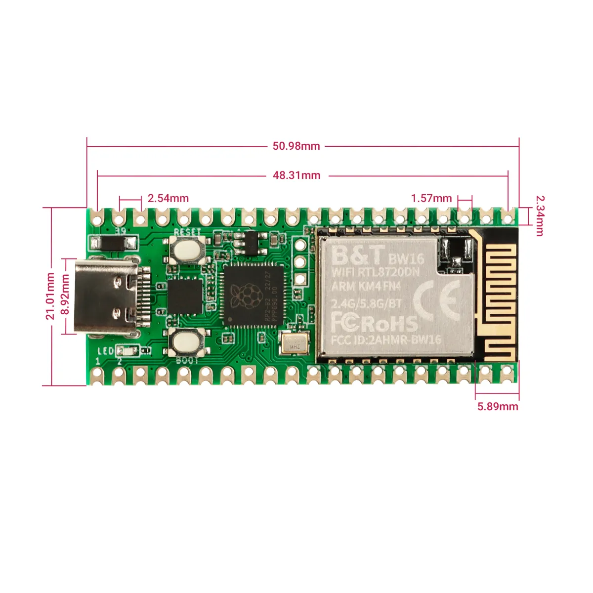

# RP2350 Pico W5

Elecrow 推出的 Pico 2 W 升级版本，尺寸和功能上兼容标准的 Pico 2 W，但是支持 5G 无线信号，存储容量增加到 8M，带有复位按钮，以及使用了 usb type c 接口。

**引脚图**

**外形尺寸**

## 相关链接

- [开发板网站](https://www.elecrow.com/wiki/Elecrow_RP2350_Pico_W5_Board.html)
- 树莓派 Pico2 W 固件
    - [micropython 固件](https://micropython.org/download/RPI_PICO2_W)
    - [circuitpython 固件](https://circuitpython.org/board/raspberry_pi_pico2_w/)
