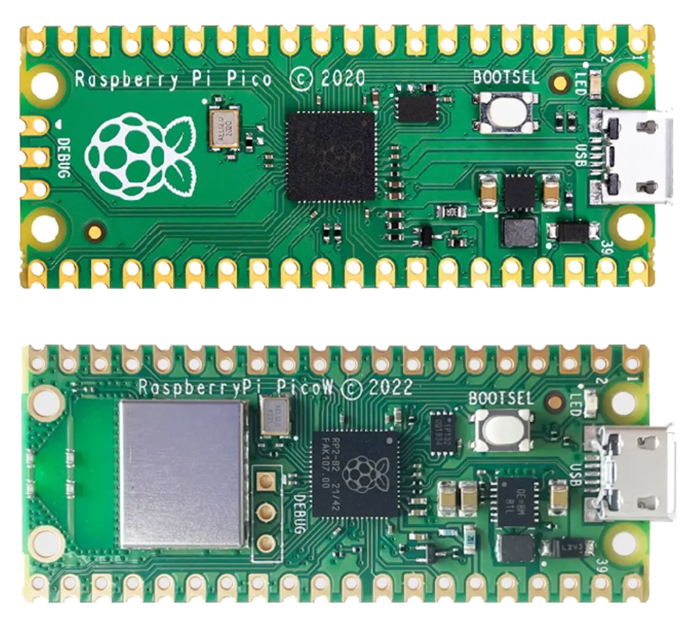
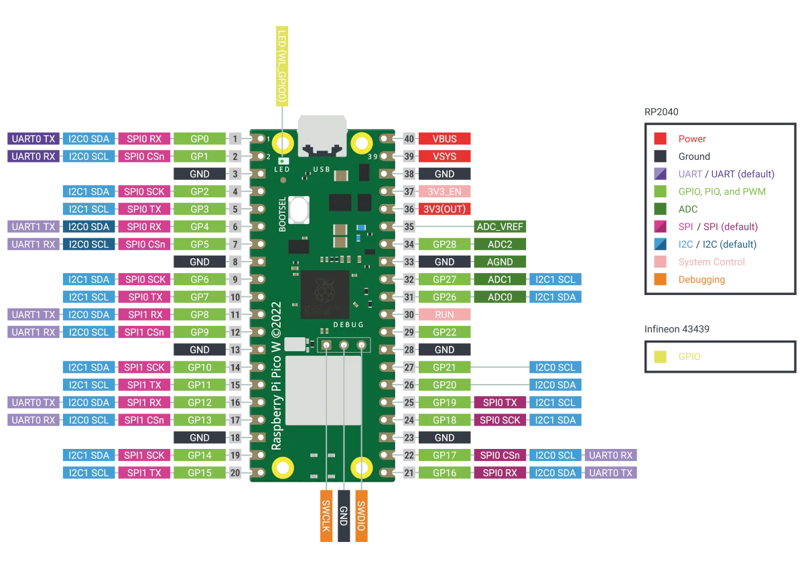

# 树莓派 Pico/ Pico W

树莓派基金会推出的 Cotex-M0+内核开发板，使用树莓派自己设计的高速双核RP2040 单片机，支持 C++/micropython/circuitpython。

Pico W 在 Pico 基础上，增加了 Wifi 和蓝牙功能，更适合物联网应用。

## 引脚图
 

现在也有不少国产的 RP2040 开发板，功能和 PICO 基本一致，而且使用了 USB Type-C 接口，性价比更高。

## 文档

- [Raspberry Pi Pico 1 datasheet](https://datasheets.raspberrypi.com/pico/pico-datasheet.pdf)
- [Raspberry Pi Pico 1 W datasheet](https://datasheets.raspberrypi.com/picow/pico-w-datasheet.pdf)
- [Getting started with Raspberry Pi Pico: C/C++ development](https://datasheets.raspberrypi.com/pico/getting-started-with-pico.pdf)
- [Raspberry Pi Pico C/C++ SDK](https://datasheets.raspberrypi.com/pico/raspberry-pi-pico-c-sdk.pdf)
- [API-level Doxygen documentation for the Raspberry Pi Pico C/C++ SDK](http://rptl.io/pico-doxygen)
- [Raspberry Pi Pico Python SDK](https://datasheets.raspberrypi.com/pico/raspberry-pi-pico-python-sdk.pdf)
- [Connecting to the internet with Raspberry Pi Pico W](https://datasheets.raspberrypi.com/picow/connecting-to-the-internet-with-pico-w.pdf)
- [Raspberry Pi RP2040 datasheet](https://datasheets.raspberrypi.com/rp2040/rp2040-datasheet.pdf)
- [Hardware design with RP2040](https://datasheets.raspberrypi.com/rp2040/hardware-design-with-rp2040.pdf)
- [Raspberry Pi Pico design files](https://datasheets.raspberrypi.com/pico/RPi-Pico-R3-PUBLIC-20200119.zip)
- [Raspberry Pi Pico 1 W design files (Cadence Allegro)](https://datasheets.raspberrypi.com/picow/RPi-PicoW-PUBLIC-20220607.zip)
- [Raspberry Pi Pico 1 STEP file](https://datasheets.raspberrypi.com/pico/Pico-R3-step.zip)
- [Raspberry Pi Pico 1 W STEP file](https://datasheets.raspberrypi.com/picow/PicoW-step.zip)
- [3-pin debug connector](https://datasheets.raspberrypi.com/debug/debug-connector-specification.pdf)
- [Pico 开发板系列文档](https://www.raspberrypi.com/documentation/microcontrollers/pico-series.html)
- [Fritzing Part for Raspberry Pi Pico](https://datasheets.raspberrypi.com/pico/Pico-R3-Fritzing.fzpz)
- [Fritzing Part for Raspberry Pi Pico H](https://datasheets.raspberrypi.com/pico/PicoH-Fritzing.fzpz)
- [Fritzing Part for Raspberry Pi Pico W](https://datasheets.raspberrypi.com/picow/PicoW-Fritzing.fzpz)

## 相关链接

- [开发板网站](https://www.raspberrypi.com/products/raspberry-pi-pico/)
- 树莓派 Pico 固件
    - [micropython 固件](https://micropython.org/download/RPI_PICO/)
    - [circuitpython 固件](https://circuitpython.org/board/raspberry_pi_pico/)
- 树莓派 Pico W 固件
    - [micropython 固件](https://micropython.org/download/RPI_PICO_W/)
    - [circuitpython 固件](https://circuitpython.org/board/raspberry_pi_pico_w/)
