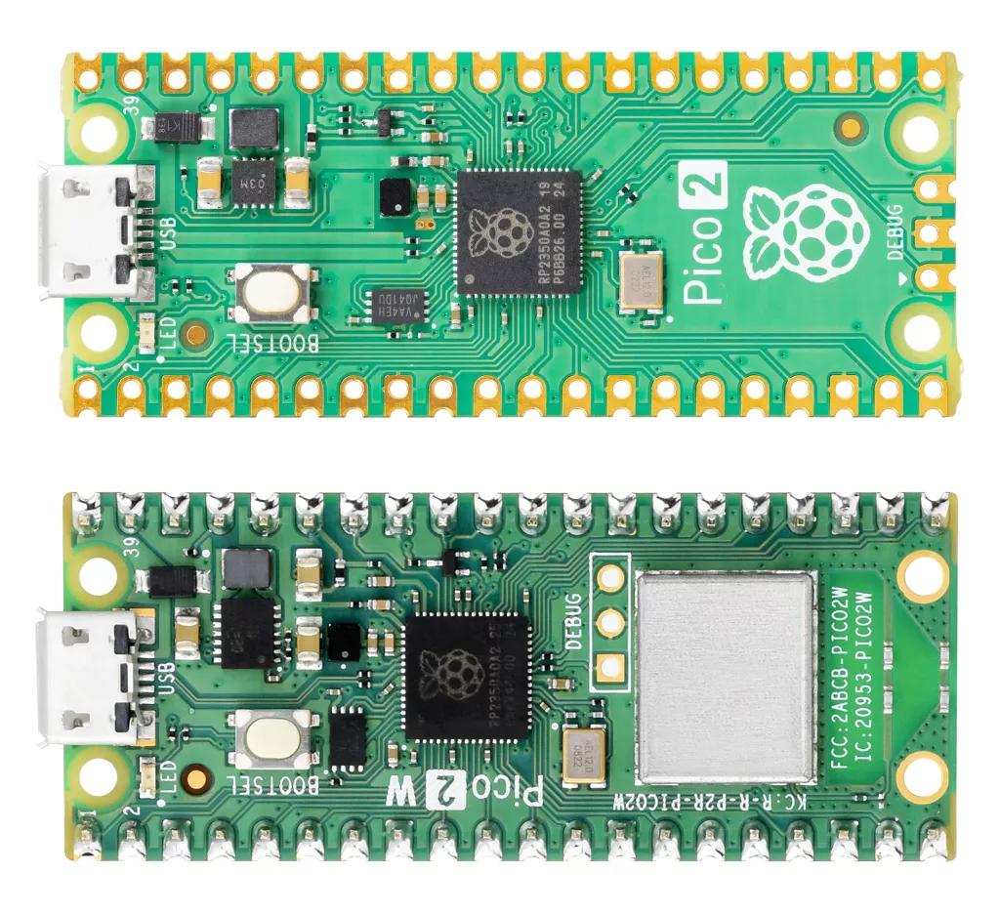

# 树莓派 Pico2/ Pico2 W

作为pico的升级版本，搭载更高的核心时钟速度、双倍内存、更强大的 Arm 核心、可选的 RISC-V 核心、新的安全特性和升级的接口功能，Raspberry Pi Pico 2 在保持与 Raspberry Pi Pico 系列兼容性的同时，提供了显著的性能提升。
可用 C/C++和 Python编程，并附带详细文档，Raspberry Pi Pico 2 是爱好者和专业开发者理想的微控制器板。

### 文档
- [Raspberry Pi Pico 2 系列产品简介](https://datasheets.raspberrypi.com/pico/pico-2-product-brief.pdf)
- [树莓派 Pico 2 MicroPython SDK](https://datasheets.raspberrypi.com/pico/raspberry-pi-pico-python-sdk.pdf)
- [Raspberry Pi Pico 2 C/C++ SDK](https://datasheets.raspberrypi.com/pico/raspberry-pi-pico-c-sdk.pdf)

https://www.raspberrypi.com/products/raspberry-pi-pico-2/
