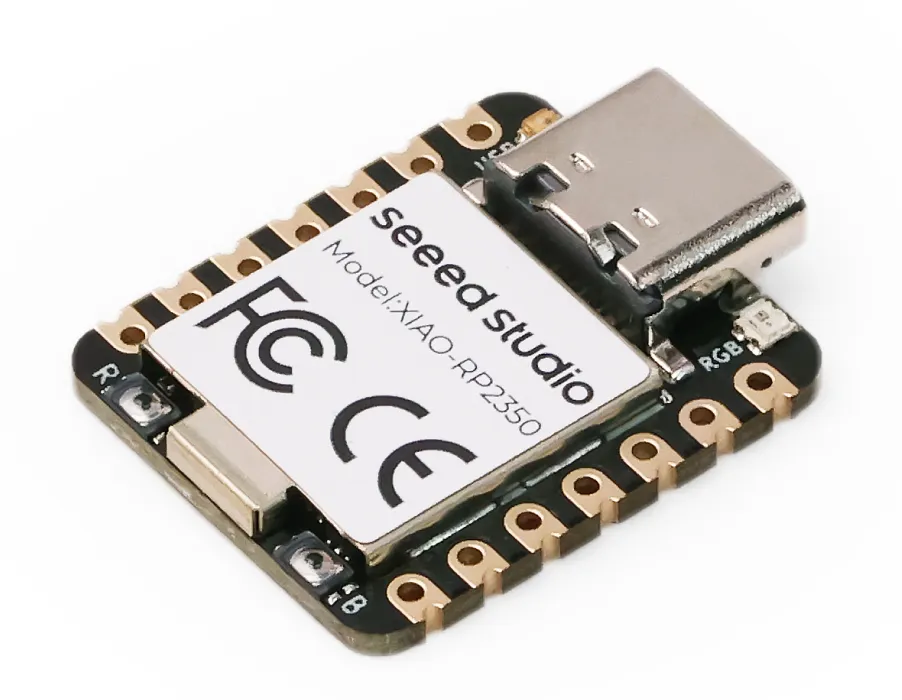
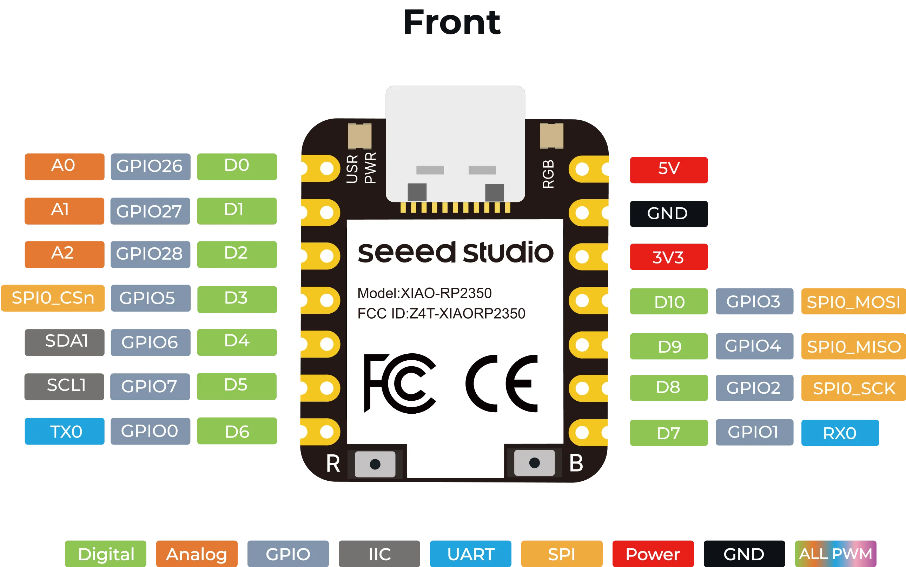
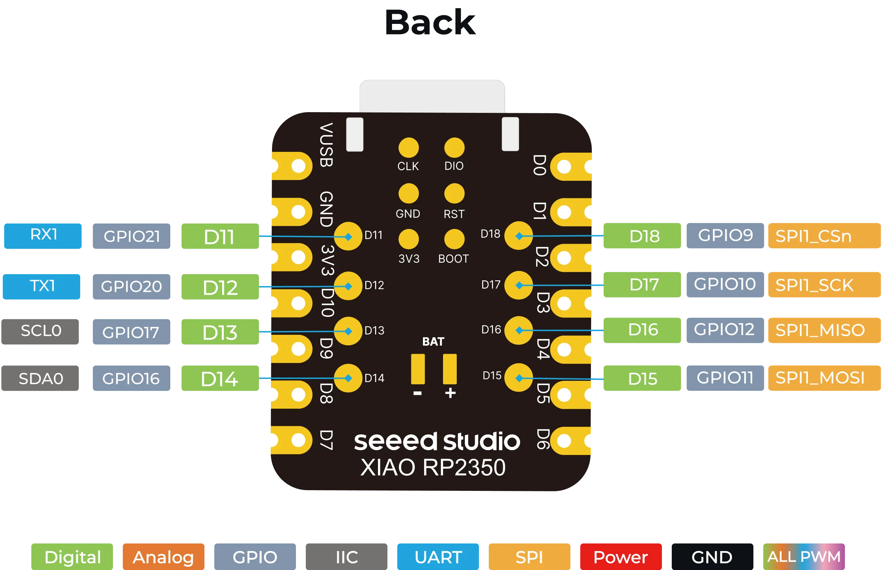

# Seeed Studio XIAO RP2350

矽递 的 XIAO 系列开发板的 RP2350，既有小巧体积，又有强大的功能。

## 特性

* 强大的 MCU 板：配备 Raspberry Pi RP2350 芯片，具有对称双 Arm Cortex-M33 @ 150MHz 和 FPU。
* 增强的安全特性：内置安全启动和加密引导加载程序确保应用程序安全。
* 软件支持：兼容 C/C++ 和 MicroPython，确保轻松的项目开发和原型制作。
* 丰富的板载资源：集成 RGB LED、2MB 闪存、520kB SRAM 和 19 个多功能 GPIO（模拟、数字、I²C、UART、SPI、PWM）。
* 扩展的 8 个新 IO：与之前的 XIAO MCU 相比，背面增加的 8 个 IO 引脚支持更复杂的应用。
* 高效的电源设计：睡眠模式下仅 50μA 的超低功耗，支持电池供电。通过内部 IO 直接测量电池电压，增强电池管理系统（BMS）。
* 紧凑的拇指大小设计：尺寸为 21 x 17.8mm，采用 Seeed Studio 经典的 XIAO 外形尺寸，非常适合空间受限的应用。
* 生产友好：表面贴装器件（SMD）设计，所有组件都在正面，两侧有邮票孔，便于高效的批量生产。

## 引脚图

## 相关链接

* [开发板网站](https://wiki.seeedstudio.com/cn/getting-started-xiao-rp2350/)
	* 📄 **PDF** [RP2350 数据手册](https://datasheets.raspberrypi.com/rp2350/rp2350-datasheet.pdf)
	* 📄 **PDF** [Seeed Studio XIAO RP2350 原理图](https://files.seeedstudio.com/wiki/XIAO-RP2350/res/Seeed-Studio-XIAO-RP2350-v1.0.pdf)
	* 📄 **XLSX** [Seeed Studio XIAO RP2350 引脚图表](https://files.seeedstudio.com/wiki/XIAO-RP2350/res/XIAO-RP2350-pinout-sheet.xlsx)
	* 📄 **DXF** [Seeed Studio XIAO RP2350 DXF 尺寸图](https://files.seeedstudio.com/wiki/XIAO-RP2350/res/XIAO-RP2350-dimension-v1.0.dxf)
	* 🔗 **链接** [Seeed Studio XIAO RP2350 3D STEP 文件](https://grabcad.com/library/seeed-studio-xiao-rp2350-2)
	* 📄 **ZIP** [Seeed Studio XIAO RP2350 v1.0 原理图和 PCB](https://files.seeedstudio.com/wiki/XIAO-RP2350/res/XIAO_RP2350_v1.0_SCH&PCB_240626.zip)
	* 📄 **UF2** [低功耗测试固件](https://files.seeedstudio.com/wiki/XIAO-RP2350/res/powman_timer-56.uf2)
* [micropython 固件](https://micropython.org/download/SEEED_XIAO_RP2350/)
* [circuitpython 固件](https://circuitpython.org/board/seeeduino_xiao_rp2350/)

