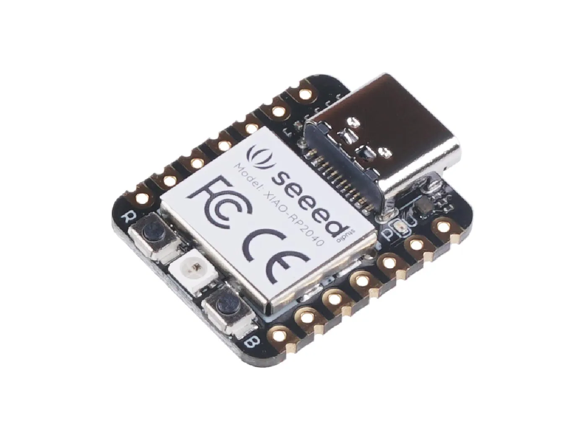
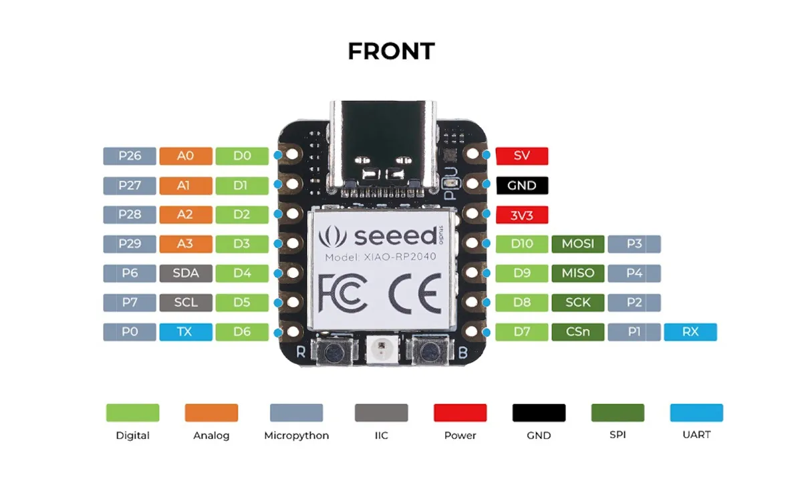

# Seeed Studio XIAO RP2040

Seeed XIAO （拇指系列开发板）。

Seeed Studio XIAO RP2040与Seeed Studio XIAO SAMD21一样小巧，但更加强大。一方面，它搭载了强大的双核RP2040处理器，可灵活运行高达133 MHz的时钟频率，是一款低功耗微控制器。在Seeed Studio XIAO RP2040上还有264KB的SRAM和2MB的板载闪存，可提供更多的程序存储和运行空间。另一方面，这块小板子在处理性能上表现出色，但功耗较低。

总之，它设计成了一个迷你的尺寸，仅有拇指大小（20x17.5mm），可用于可穿戴设备和小型项目。

Seeed Studio XIAO RP2040上有14个GPIO引脚，其中包括11个数字引脚、4个模拟引脚、11个PWM引脚、1个I2C接口、1个UART接口、1个SPI接口和1个SWD Bonding pad接口。

## 引脚图

## 链接

- [Seeed Studio XIAO RP2040 开发板](https://wiki.seeedstudio.com/cn/XIAO-RP2040/)
- [Adafruit QT Py RP2040](https://learn.adafruit.com/adafruit-qt-py-2040/overview)

## 资源文件

- **\[PDF\]** [RP2040 数据手册](https://files.seeedstudio.com/wiki/XIAO-RP2040/res/rp2040_datasheet.pdf)
- **\[PDF\]** [Seeed Studio XIAO RP2040 原理图](https://files.seeedstudio.com/wiki/XIAO-RP2040/res/Seeed-Studio-XIAO-RP2040-v1.3.pdf)
- **\[ZIP\]** [Seeed Studio XIAO RP2040 KiCAD 文件](https://files.seeedstudio.com/wiki/XIAO-RP2040/res/Seeeduino-xiao-rp2040-KiCAD-Library.zip)
- **\[ZIP\]** [Seeed Studio XIAO RP2040 Eagle 文件](https://files.seeedstudio.com/wiki/XIAO-RP2040/res/XIAO_RP2040_v1.22_SCH&PCB.zip)
- **\[DXF\]** [Seeed Studio XIAO RP2040尺寸在DXF](https://files.seeedstudio.com/wiki/XIAO-RP2040/res/XIAO-RP2040-DXF.zip)
- **\[LBR\]** [Seeed Studio XIAO RP2040的Eagle封装图案](https://files.seeedstudio.com/wiki/XIAO-RP2040/res/Seeed-Studio-XIAO-RP2040-footprint-eagle.lbr)
- **\[XLSX\]** [Seeed Studio XIAO RP2040 引脚分配表](https://files.seeedstudio.com/wiki/XIAO-RP2040/res/XIAO-RP2040-pinout_sheet.xlsx)
- **\[STEP\]** [Seeed Studio XIAO RP2040 3D 模型](https://files.seeedstudio.com/wiki/XIAO-RP2040/res/seeed-studio-xiao-rp2040-3d-model.zip)
- **\[ZIP\]** [Seeed Studio XIAO RP2040认证文件](https://files.seeedstudio.com/wiki/XIAO-RP2040/res/XIAO-RP2040-Certification.zip)
