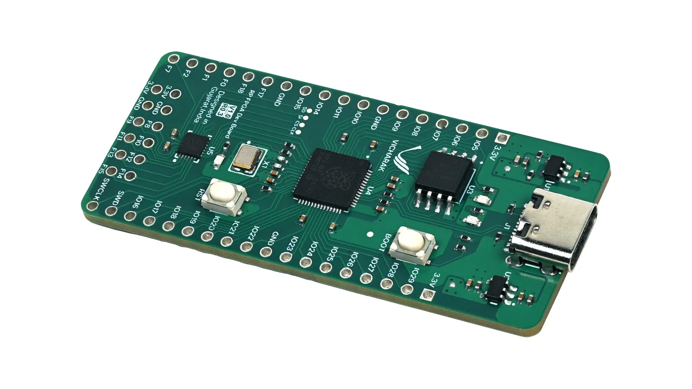
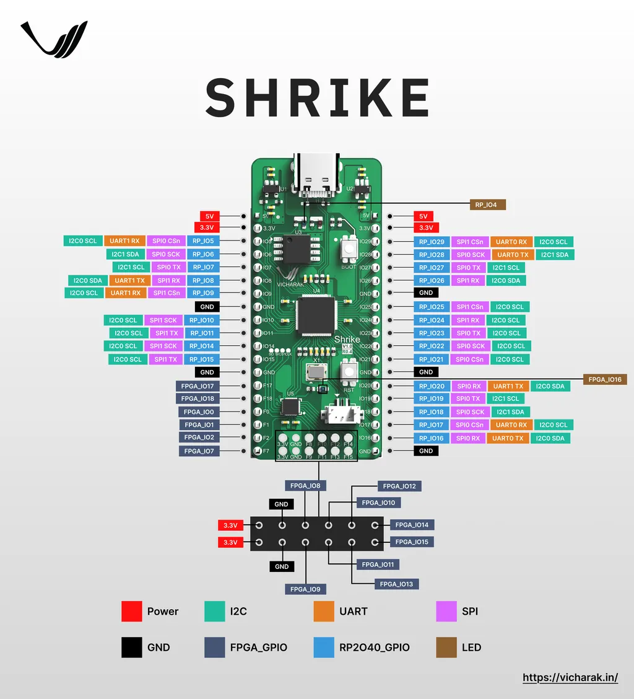

# Shrike Lite

Shrike-lite 是一款低成本的开源微控制器+FPGA 开发板，结合了 RP2040 微控制器和 1120 LUT FPGA。它采用PMOD连接器、兼容面包板的布局、集成的FPGA-MCU IO接口、QSPI闪存、双用户LED和USB Type-C,用于电源/编程，非常适合学习者、业余爱好者以及硬件/软件共同设计原型设计。

## 主要特点

- 将 FPGA（1120 个 5 输入 LUT）和 RP2040 ARM Cortex-M0 微控制器组合在一块板上
- FPGA 和 MCU 之间的集成 IO 接口，可实现灵活的协处理和硬件/软件分区
- 用于模块化附加组件和扩展模块的 PMOD 兼容连接器
- 面包板兼容设计（引脚间距/布局），便于原型设计
- 用于配置和存储的板载 QSPI 闪存
- 两个用户 LED，用于简单的状态指示灯
- USB Type-C 端口，用于电源和编程

## 您将探索/学习

- 使用嵌入式 C 或 MicroPython 对 RP2040 微控制器进行编程
- 使用 Verilog 或 VHDL 设计 FPGA 的数字逻辑
- 构建结合固件和硬件加速的混合项目

## 引脚图

## 相关链接

- [github 仓库](https://github.com/vicharak-in/shrike-lite/)
- [Vicharak 在线商店](https://store.vicharak.in/?product=shrike&post_type=product&name=shrike&v=7efdfc94655a)
- [cnx 介绍](https://www.cnx-software.com/2025/10/16/4-shrike-lite-fpga-board-renesas-forgefpga-raspberry-pi-rp2040-mcu/)
