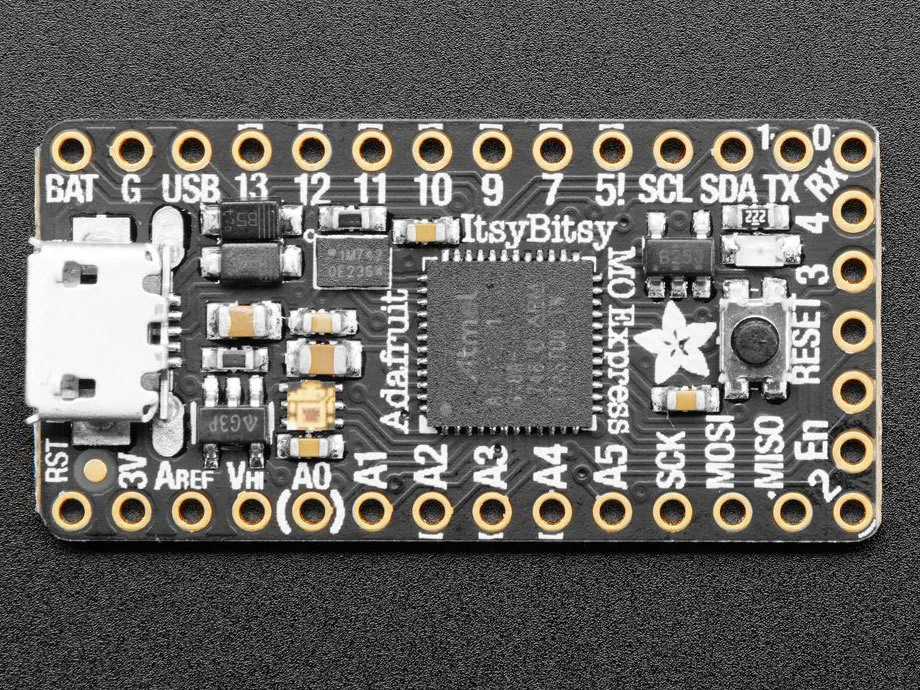

# Adafruit ItsyBitsy M0 Express

Adafruit ItsyBitsy M0 Express 开发板，同样使用了 ATSAMD21 处理器，引脚比 Adafruit Trinket M0 更多，但布局仍然紧凑。ItsyBitsy M0 Express 只有 1.4 英寸长 x 0.7 英寸宽，但有 6 个电源引脚、23 个数字 GPIO 引脚（其中 11 个可以是模拟输入、1 个模拟输出和 13 个 PWM 输出）。它甚至内置了 2MB 的 SPI 闪存，用于数据记录、文件存储或代码。
 

 
**相关链接**
- [开发板说明](https://www.adafruit.com/product/3727)
- [micropython 固件](https://micropython.org/download/ADAFRUIT_ITSYBITSY_M0_EXPRESS/)
- [circuitPython 固件](https://circuitpython.org/board/itsybitsy_m0_express/)
- [PCB 设计文件](https://github.com/adafruit/Adafruit-ItsyBitsy-M0-PCB)
