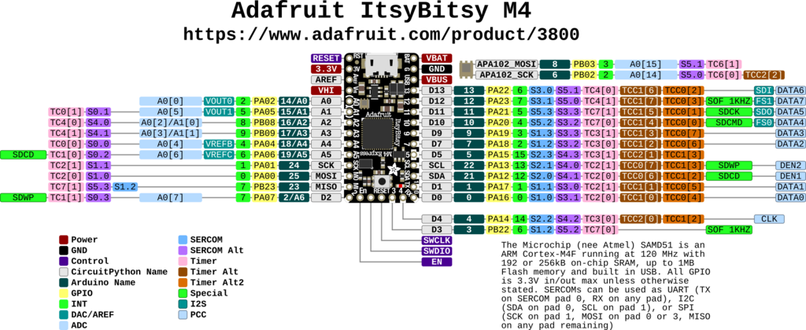

# Adafruit ItsyBitsy M4 Express

Adafruit ItsyBitsy M4 Express 体积小，功能强大，使用运行频率为 120 MHz 的 ATSAMD51 Cortex M4 处理器，支持浮点，具有 512KB 闪存和 192KB RAM。

**相关链接**：

- [产品说明](https://www.adafruit.com/product/3800)
- [micropython 固件](https://micropython.org/download/ADAFRUIT_ITSYBITSY_M4_EXPRESS/)
- [circuitpython 固件](https://circuitpython.org/board/itsybitsy_m4_express/)
- [circuitpython 固件](https://circuitpython.org/board/itsybitsy_m4_express/)
- [PCB 设计文件](https://github.com/adafruit/Adafruit-ItsyBitsy-M4-Express-PCB)
