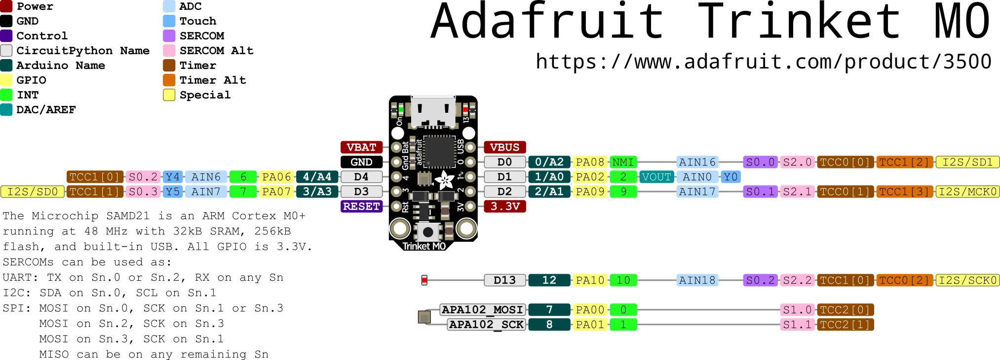

# Adafruit Trinket M0

Adafruit Trinket M0 是一个微型低成本开发板，使用 Atmel ATSAMD21 微控制器。支持 CircuitPython、MIcroPython、Arduino、makecode等多种编程方式。

**相关链接**
- [开发板说明](https://www.adafruit.com/product/3500)
- [micropython 固件](https://micropython.org/download/ADAFRUIT_TRINKET_M0/)
- [circuitPython 固件](https://circuitpython.org/board/trinket_m0/)
- [PCB 设计文件](https://github.com/adafruit/Adafruit-Trinket-M0-PCB)
