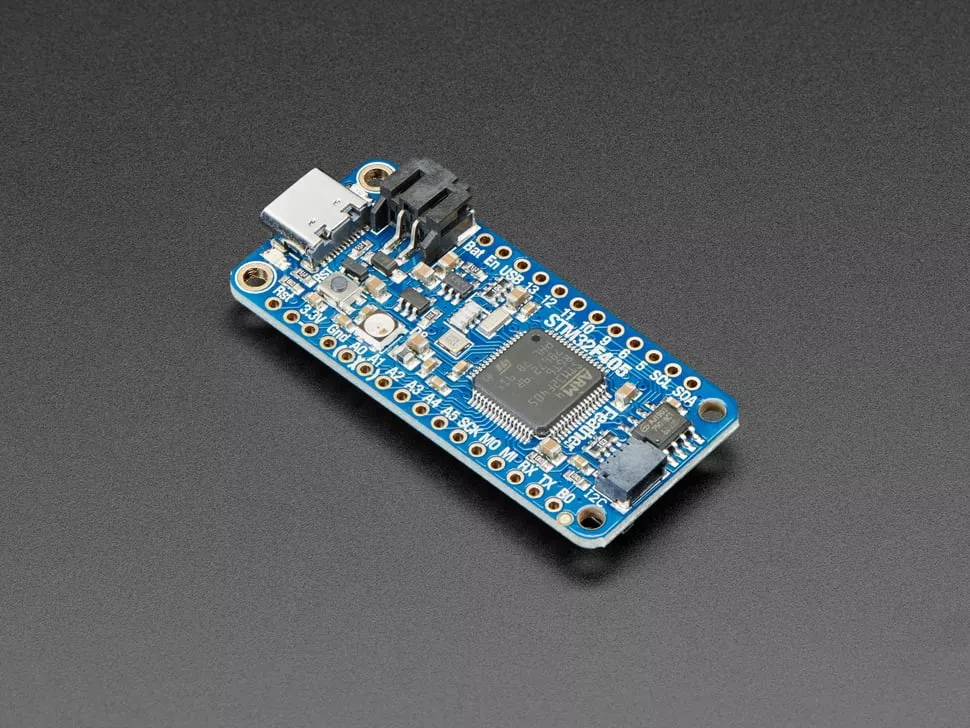
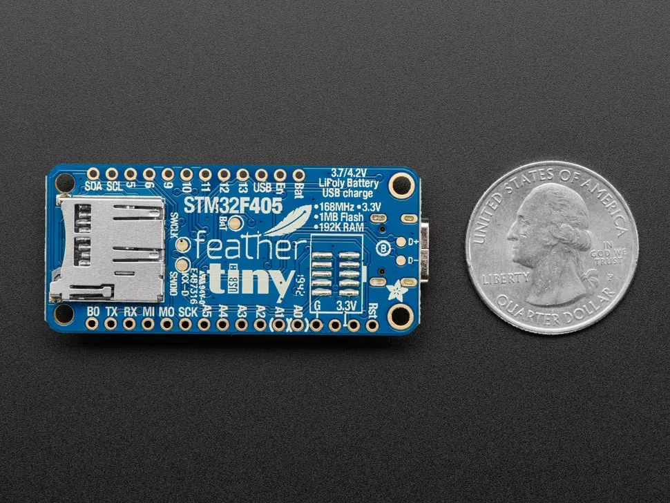

# Feather STM32F405 Express

Adafruit 羽毛系列开发板的 Feather STM32F405 Express，使用了和 pyboard 相同的处理器芯片，并带有一个 STEMMA QT / Qwiic 接口。

## 特性

* 搭载 STM32F405 Cortex M4 内核（含浮点运算单元 FPU），拥有 1MB 闪存（Flash），运行频率 168MHz
* 192KB 静态随机存取存储器（RAM）—— 其中 128KB 为通用 RAM，64KB 为仅程序运行 / 缓存专用 RAM
* 逻辑电平为 3.3V，但几乎所有引脚均支持 5V 输入！
* 采用 USB Type-C 接口，可同时实现供电与数据传输 —— 这是首款配备 USB Type-C 接口的羽毛系列开发板！
* 带有锂电池（LiPo）接口及充电电路
* 配备 SD 卡插槽，使用 SDIO 接口方式
* 集成 2MB SPI 闪存芯片
* 内置 NeoPixel 指示灯
* 支持 I2C、UART（通用异步收发传输器）、GPIO（通用输入输出）、ADC（模数转换器）、DAC（数模转换器）等接口 / 功能
* 配备 Qwiic/STEMMA-QT 接口，可实现高速 I2C 连接
* 采用内置的 USB DFU 引导加载程序（bootloader）烧录固件，不含 UF2 引导加载程序

## 相关链接

* [micropython 固件下载](https://micropython.org/download/ADAFRUIT_F405_EXPRESS/)
* [circuitpython 固件下载](https://circuitpython.org/board/feather_stm32f405_express/)
* [官方开发板商城](https://www.adafruit.com/product/4382)
* [Feather STM32F405 Express 开发板说明](https://learn.adafruit.com/adafruit-stm32f405-feather-express)
* [PCB 设计文档](https://github.com/adafruit/Adafruit-Feather-STM32F405-Express-PCB)
