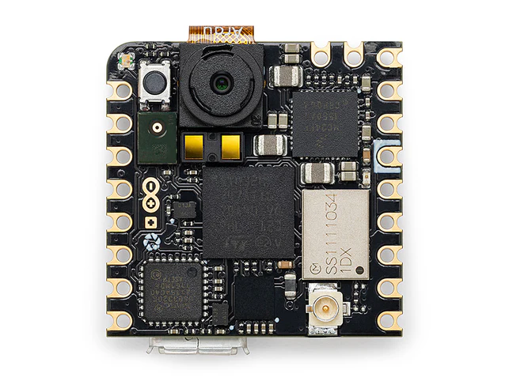

# Arduino Nicla Vision

Arduino Nicla Vision 集成了强大的 STM32H747AII6 ARM® Cortex® M7/M4 IC 处理器和支持 TinyML 的 200 万彩色摄像头，以及智能六轴运动传感器、集成麦克风和距离传感器。

## 引脚图

## 相关链接

- [开发板网站](https://store.arduino.cc/collections/nicla-family/products/nicla-vision)
	- [文档](https://docs.arduino.cc/hardware/nicla-vision)
	- [原理图](https://docs.arduino.cc/resources/schematics/ABX00051-schematics.pdf)
- [micropython 固件](https://micropython.org/download/ARDUINO_NICLA_VISION/)
